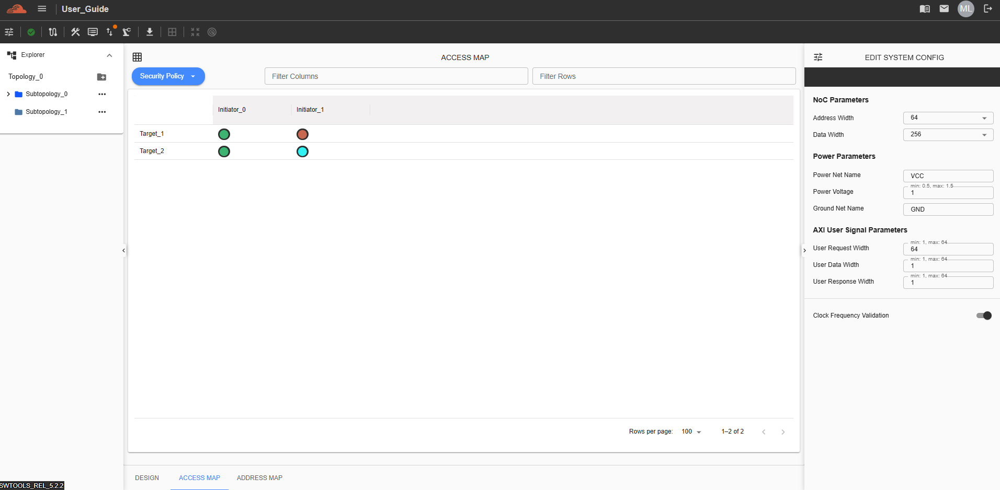

Access Map 
=================================
The Access Map feature provides a matrix view of the policy assigned to each device connected to every port within the topology. At present, the only supported category is the Security Policy. This matrix displays the policies associated with each device type—Initiator, Target, and Virtual Target. Users can also configure the policy settings directly within the matrix, and any changes will be immediately reflected on the corresponding device.

To access this feature, navigate to the “Access Map” tab.

Security Policy
----------------------------------------------------

This section defines the security policy assigned to each device. The Security Device itself is excluded from the matrix view.

Users can select from the following four policies:

  - Passthrough

  - Fixed Secure

  - Programmable

  - Blocked

Cells that appear greyed out indicate that the corresponding device is not reachable from that port.

