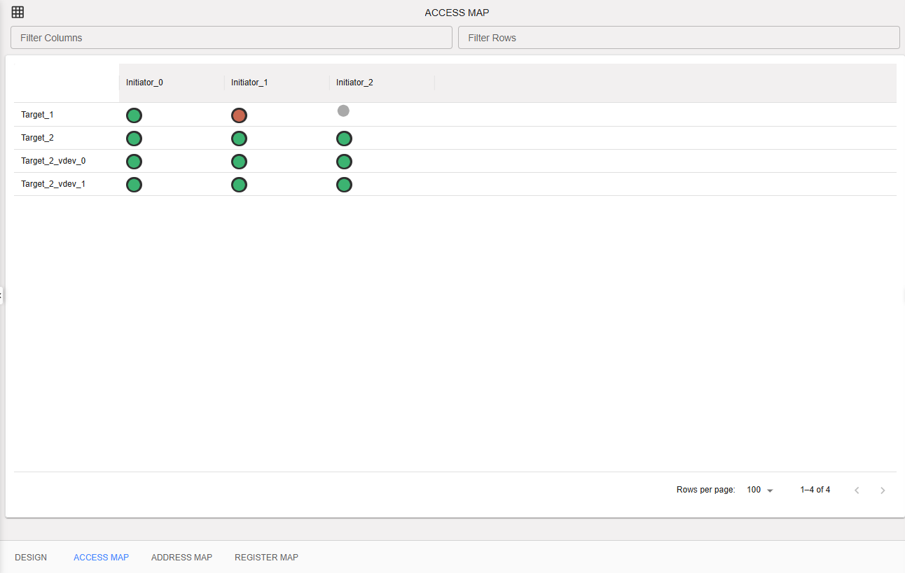

=========================
NC-NoC Access Map
=========================

The **Access Map** feature provides a matrix view of the security policies assigned to each device connected to every port within the topology. 

This matrix dynamically displays policies associated with every supported device type—including **Initiators**, **Targets**, and **Virtual Targets**. Users can configure policy settings directly within the matrix cells; any modifications are immediately reflected on the corresponding device.

.. note::
   The Access Map focuses strictly on port-to-device configurations. The Security Device itself is explicitly excluded from this matrix view.

--------------------------------------------------------------------------------

Supported Security Policies
==============================

You can configure and assign one of four distinct security policies to any reachable device path:

* **Passthrough** — Unfiltered traffic transmission across the port.
* **Fixed Secure** — Permanent hardware-enforced security rules applied to the device channel.
* **Programmable** — Soft-configured policies that can be updated dynamically at runtime.
* **Blocked** — Complete traffic isolation; all transactions through this path are rejected.

.. tip::
   **Greyed-out cells** inside the matrix indicate that the corresponding device is **not reachable** from that specific port within your current topology routing.

--------------------------------------------------------------------------------

How to Use the Map
=====================

1. Navigate to the **Access Map** tab in the main configuration workspace menu.
2. Locate the intersection cell matching your desired port and device.
3. Use the dropdown selector within the cell to alter the policy state. 

