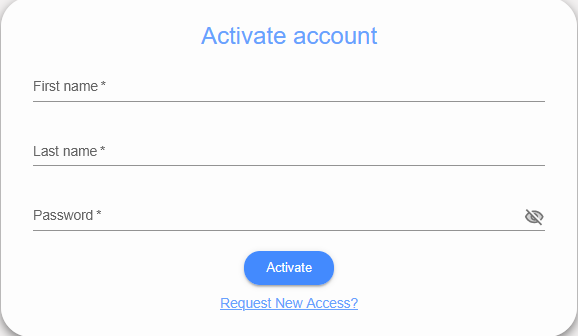
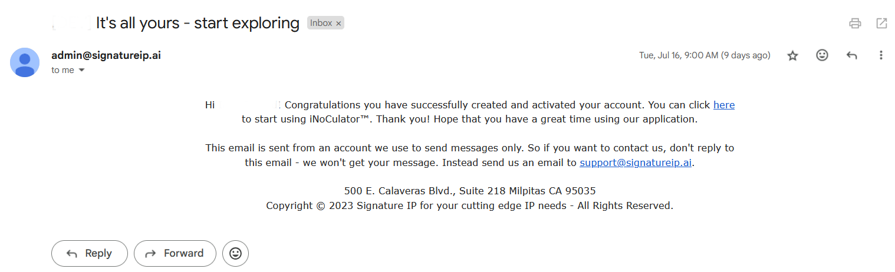

Activate Account
=====================================================
This feature manages the formal acceptance and activation of a user account in iNoCulator. To begin the activation process, the user must click the link provided in the invitation email. This will open a browser tab directing the user to the Account Activation screen.

-------------------------------------------------------------------------

Input Guidelines:
    - Capitalize only the first letter of the First Name and Last Name.

    - Use alphanumeric characters only, including ñ and Ñ, and spaces.

    - Special characters are not allowed.

Once the form is completed, click the Activate button to finalize account creation. A confirmation email will be sent to indicate that the account has been successfully activated.

