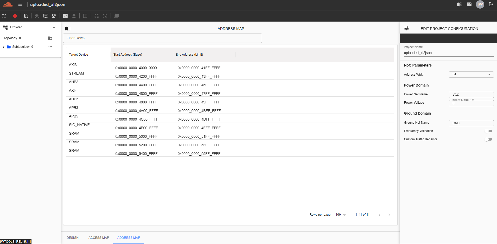
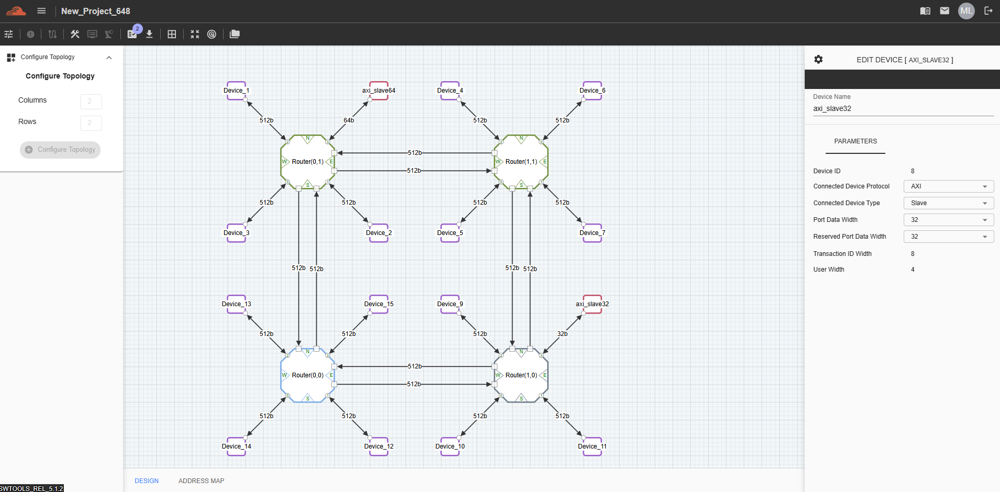
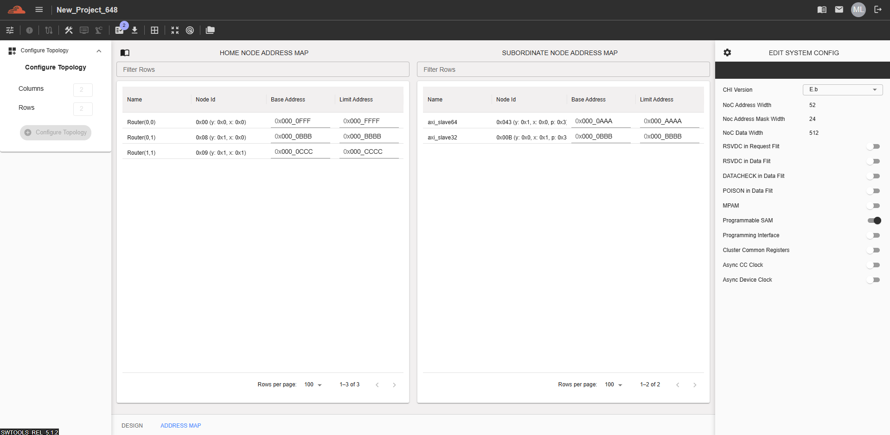

Address Map for C-NoC and NC-NoC
===================================================

NC-NoC 
------------------------------------------------

This feature displays the address range of all target devices in the topology. By default, addresses are configured automatically, but users can still configure them manually. To configure this, navigate to “Address Map” tab.  

C-NoC 
------------------------------------------------

There are two Address Maps available for the Coherent NoC topology. The first one is the **Home Node Address Map**, which displays the addresses of routers connected to the grid. By default, the names displayed in the column are the routers' default coordinates for easy navigation. The second one is **Subordinate Node Address Map**, which displays the addresses of AXI slave devices connected to a Router. 

Here is the sample Topology design. 

The Router Type should be set to HN-F w/ L3 or HN-F w/o L3 to configure the Address Map of the Home Node Address Map. Other Router Types, such as DVM Node, Device Only, and Repeater, do not allow users to configure the Address Map. 

Device Protocol and Device Type should be set to AXI and Slave to configure the Subordinate Node Address Map. Other Device Protocols and Device Types do not allow users to configure the Address Map.

