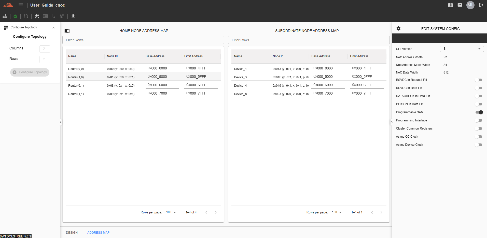

Address Map
===================================================

NC-NoC
------------------------------------------------

The Address Map feature displays the address ranges assigned to all Target Devices within the topology. By default, these addresses are automatically generated. However, users have the option to manually configure the address ranges as needed.

To access this feature, navigate to the “Address Map” tab.

.. image:: images/address_map4.png
  :alt: address_map
  :align: center

C-NoC
------------------------------------------------

There are two types of Address Maps available for the Coherent NoC topology:

Home Node Address Map
~~~~~~~~~~~~~~~~~~~~~~~~~~~~~~~~~~~~

This map displays the address ranges of routers connected to the grid. By default, each router is labeled using its coordinate-based name, making it easier for users to identify and locate routers within the topology.

Subordinate Node Address Map
~~~~~~~~~~~~~~~~~~~~~~~~~~~~~~~~~~~~~

This map shows the address ranges of AXI slave devices that are connected to a specific router. It provides a clear view of how subordinate devices are mapped within the overall address space.

Below is a sample topology design illustrating how these address maps are structured and visualized.

.. image:: images/cnoc_address_map_sample.png
  :alt: cnoc_address_map_sample
  :align: center

To configure the Home Node Address Map, the Router Type must be set to either:

  - HN-F w/ L3 or

  - HN-F w/o L3

Other Router Types—such as DVM Node, Device Only, and Repeater—do not support Address Map configuration and will not allow user modifications.

To configure the Subordinate Node Address Map, both the Device Protocol and Device Type must be set as follows:

  - Device Protocol: AXI

  - Device Type: Slave

Other combinations of Device Protocols and Device Types do not support Address Map configuration and will disable editing capabilities.

