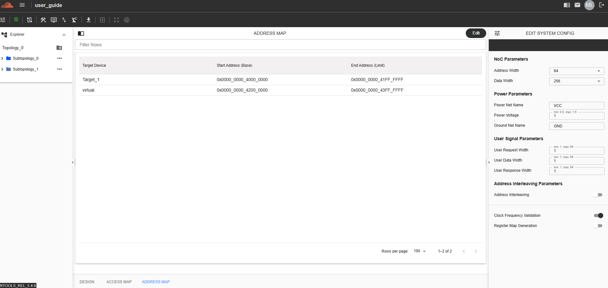
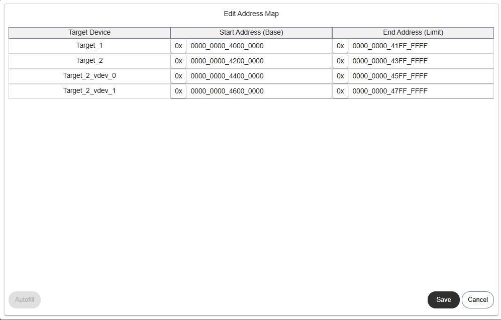

Address Map
===================================================

NC-NoC
------------------------------------------------

The Address Map feature displays the address ranges assigned to all Target Devices, including Virtual Devices within the topology. By default, these addresses are not automatically generated; users must manually configure the address ranges.

To access this feature, navigate to the “Address Map” tab.

To edit the addresses, click the "Edit" button. A modal will appear, allowing users to configure the address map. There is also an "Autofill" button that users can use to automatically fill in the blank address map.

