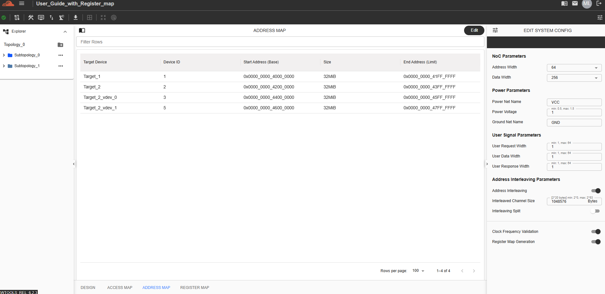
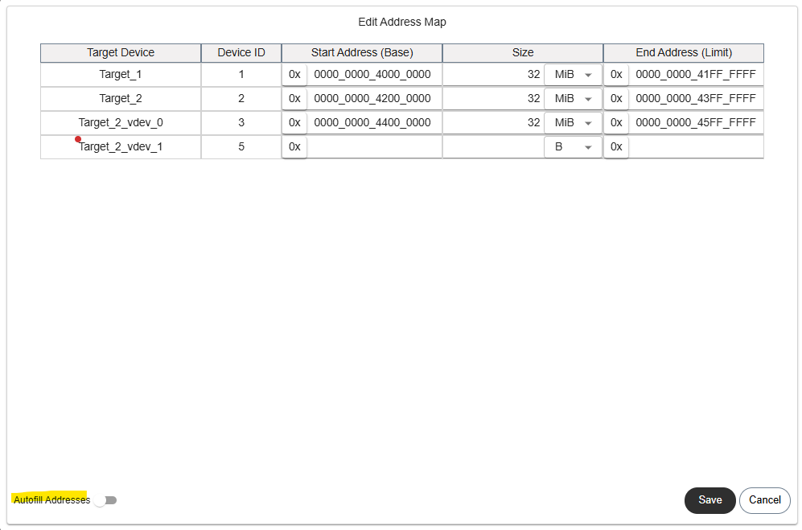

===================================================
NC-NoC Address Map
===================================================

The **Address Map** feature manages the system address space allocation across all Target and Virtual Devices mapped within your topology. 

By default, addresses are not pre-allocated; network architects must define their address maps manually or utilize the built-in system auto-generation tools. To access this workspace, navigate to the **Address Map** tab in your main design window.

--------------------------------------------------------------------------------

Bidirectional Field Synchronization
========================================

The address grid features dynamic recalculation logic to maintain system consistency. Modifying either field updates its counterpart instantly:

.. list-table:: Real-Time Address Computations
   :widths: 30 70
   :header-rows: 1

   * - Active User Action
     - Automatic Engine Calculation
   * - Edit the **Size** column value
     - The **End Address** is instantly recalculated based on the updated range.
   * - Edit the **End Address** column
     - The **Size** range span is dynamically re-computed.

--------------------------------------------------------------------------------

Manual and Automated Workflows
===================================

To alter the memory layout properties, click the **Edit** button. A modal configuration interface will launch, providing two methods of execution:

Manual Configuration
   Allows granular input control to set exact, user-defined memory space ranges directly inside the table rows.

Automated Provisioning
   Activating the **Autofill Addresses** toggle button prompts the compiler to sweep the memory architecture and automatically populate all unassigned, blank address fields across the target spaces.

.. tip::
   Use the **Autofill Addresses** option as a structural baseline when bootstrapping complex multi-target topologies to rapidly clear address alignment overlap errors.

