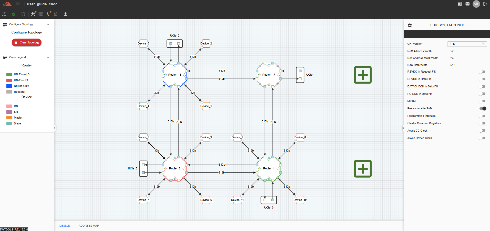
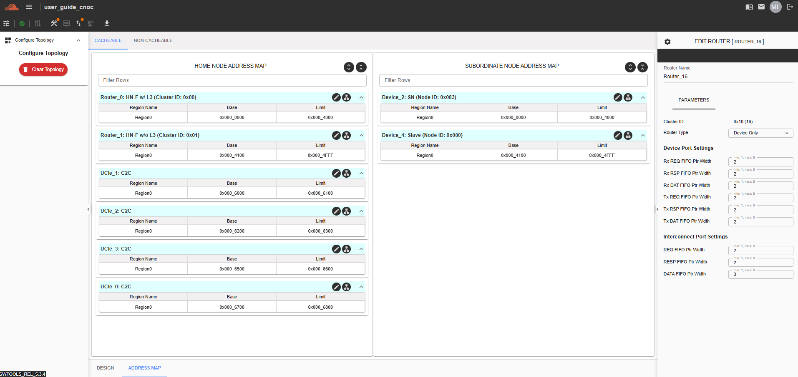
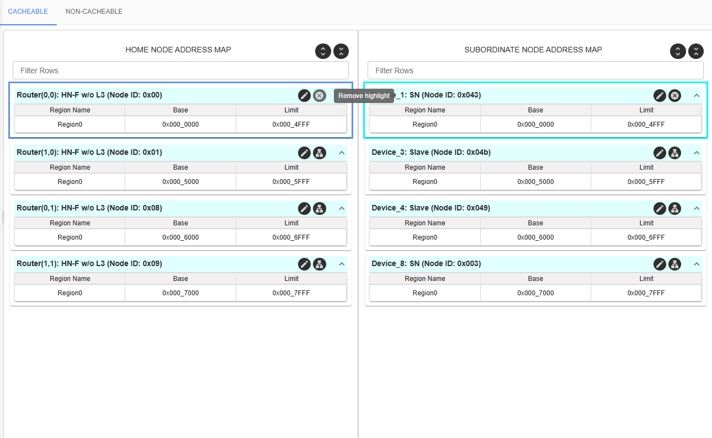

Address Map
===================================================

NC-NoC
------------------------------------------------

The Address Map feature displays the address ranges assigned to all Target Devices, including Virtual Devices within the topology. By default, these addresses are not automatically generated; users must manually configure the address ranges.

To access this feature, navigate to the “Address Map” tab.

.. image:: images/address_map6.png
  :alt: address_map
  :align: center

To edit the addresses, click the "Edit" button. A modal will appear, allowing users to configure the address map. There is also an "Autofill" button that users can use to automatically fill in the blank address map.

.. image:: images/address_map_modal1.png
  :alt: address_map_modal
  :align: center

C-NoC
------------------------------------------------

There are two types of Address Map tables within the C-NoC topology: Cacheable and Non-Cacheable Address Maps. Each type contains two tables: the Home Node Address Map and the Subordinate Node Address Map.

Cacheable and Non-Cacheable Address Map

This user guide provides detailed information and instructions for understanding and validating the Cacheable Address Map and Non-Cacheable Address Map within the system’s interconnect or NoC (Network-on-Chip) topology. These address maps are critical for efficient memory access and data routing across home and subordinate nodes.

Home Node Address Map
~~~~~~~~~~~~~~~~~~~~~~~~~~~~~~~~~~~~

The Home Node Address Map defines the memory address regions that are locally owned, managed, or controlled by the current node. This map is used to determine which memory addresses are directly handled within the node, and it plays a critical role in:

- Routing memory access requests to the correct internal resource.

- Enabling proper cache coherence and memory consistency within the local domain.

- Identifying which address ranges are considered "home" during system operation.

- This map applies to both cacheable and non-cacheable memory regions.

- The table of Home Node includes the addresses of **Routers** and **UCIe**. 

This map displays the address ranges of routers connected to the grid. By default, each router is labeled using its coordinate-based name, making it easier for users to identify and locate routers within the topology.

Subordinate Node Address Map
~~~~~~~~~~~~~~~~~~~~~~~~~~~~~~~~~~~~~

The Subordinate Address Map defines the memory address regions that are owned or managed by external nodes (i.e., remote or subordinate nodes). This map helps the local node route memory access requests that fall outside of its domain, and it is used for:

- Forwarding transactions to the appropriate external node.

- Maintaining accurate access to distributed memory in multi-node systems.

- Supporting both cacheable and non-cacheable transactions based on the system configuration.

- This map is essential for enabling inter-node communication and access in systems with distributed memory architecture.

Below is a sample topology design illustrating how these address maps are structured and visualized.

To configure the Home Node Address Map, the Router Type must be set to either:

  - HN-F w/ L3 or

  - HN-F w/o L3

Other Router Types—such as Device Only and Repeater- do not support Address Map configuration and will not allow user modifications.

To configure the Subordinate Node Address Map, both the Device Protocol and Device Type must be set as follows:

  - Device Protocol: AXI or CHI

  - Device Type: Slave or SN

Other combinations of Device Protocols and Device Types do not support Address Map configuration and will disable editing capabilities.

Cacheable Address Map
~~~~~~~~~~~~~~~~~~~~~~~~~~~~~~~~~~~~~~~~~~~~~~~~~~~~~~~~~~

The Cacheable Address Map defines memory regions where data can be cached, improving access speed and reducing latency. It includes:

Home Node Address Map – Specifies memory regions that are owned or managed by the local/home node.

Subordinate Node Address Map – Specifies memory ranges managed by external/subordinate nodes but still marked as cacheable.

Use this map to configure, validate, and debug data transactions that benefit from caching mechanisms.

Non-Cacheable Address Map
~~~~~~~~~~~~~~~~~~~~~~~~~~~~~~~~~~~~~~~~~~~~~~~~~~~~~~~~~~~~~

The Non-Cacheable Address Map defines memory regions where caching is disabled, ensuring data consistency and direct access. It includes:

Home Node Address Map – Points to local memory regions that must bypass caches.

Subordinate Node Address Map – Indicates memory segments on remote nodes that are accessed without caching.

This section is essential for critical operations requiring real-time consistency and for peripherals or memory-mapped I/O where caching is not suitable.

.. image:: images/cnoc_address_map_non-cacheable.png
  :alt: cnoc_address_map_non-cacheable
  :align: center

Editing of the Address Map is supported per region, per router, and for each Home Node and Subordinate Node individually. The tool allows users to configure or modify memory address ranges specific to their location in the system topology, enabling fine-grained control and validation of address assignments.

.. image:: images/cnoc_address_map_editing_addresses2.png
  :alt: cnoc_address_map_editing_addresses
  :align: center

The tool also allows highlighting of the parent Home Node and Subordinate Nodes. This feature provides a clearer visual reference to quickly identify the allocation and address ranges associated with each node, making navigation and validation of the address map more intuitive and efficient.

