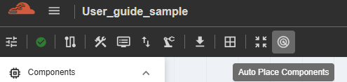

Auto Place
==================================

The NC-NoC Auto-Place feature automatically determines the optimal positions for logic gates, memory blocks, and other circuit components within the chip layout. Its primary objective is to minimize wire length, reduce signal delay, and enhance overall performance.

Additionally, the tool focuses on efficient chip area utilization by minimizing the physical space occupied by components. This results in a more compact, cost-effective, and high-performing design. 

