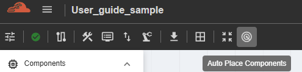

==================================
Auto Place
==================================

The **NC-NoC Auto-Place** feature automatically determines the optimal physical coordinates for routers, network interfaces, memory blocks, and other foundational circuit components within your silicon floorplan layout. 

Rather than forcing manual component placement, the placement engine runs a global optimization sweep based on your network topology connectivity matrix.

--------------------------------------------------------------------------------

Optimization Objectives
===========================

The placement engine simultaneously solves for three primary physical design parameters:

Wire Length Minimization
   Reduces the total cumulative length of interconnect routing tracks. Minimizing total wire length directly decreases parasitic capacitance, saving dynamic power consumption across the clock tree.

Signal Propagation Delay
   Brings highly coupled architectural components physically closer together. This significantly lowers multi-hop latency and boosts the maximum achievable operating frequency ($F_{max}$).

Area Utilization
   Maximizes the density of the functional silicon footprint. By eliminating fragmented, wasted space between components, the engine yields a highly compact, cost-effective floorplan layout.

.. note::
   Auto-Place works in tandem with the global routing engine. Running an Auto-Place cycle will automatically update, invalidate, or prompt a recalculation of your existing **Auto-Route** and **Floorplan** configurations.

--------------------------------------------------------------------------------

Workspace View
==================

