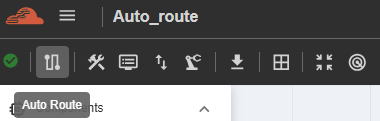
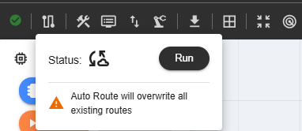
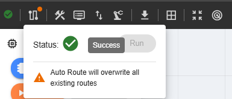
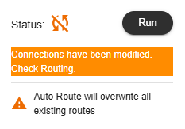
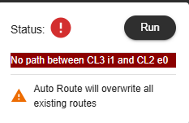

NC-NoC Auto Route 
==================================================

The NC-NoC Auto Route feature automatically generates the optimal paths for data traffic between devices in the Network-on-Chip. 
It simplifies router configuration by calculating routes based on the topology, reducing manual setup, and ensuring efficient communication across the system.

The feature provides status indicators to show the progress and result of the routing process:

**Cached** – Routes have already been calculated and stored; no new computation was needed.

**Success** – Routing completed successfully and all paths are valid.

**Updated** – Connections changed, user must re-run the Auto Route or update the routing table.

**Error** – Routing could not be completed; manual intervention may be required.

