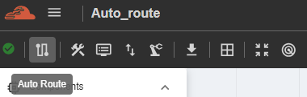

==================================================
NC-NoC Auto Route 
==================================================

The **NC-NoC Auto Route** feature automatically calculates and generates the optimal paths for data traffic between interconnected devices across the Network-on-Chip fabric. 

By evaluating your active topology graph, the routing engine eliminates manual packet routing entry, guarantees deadlock-free path allocation, and balances traffic across system switches.

To execute a routing sweep, utilize the primary action trigger:

--------------------------------------------------------------------------------

Engine Routing Status Indicators
=====================================

The engine returns real-time status feedback badges upon evaluation. Use this matrix to identify routing health and determine required actions:

🟢 Cached
   Routes have already been pre-calculated and securely stored in memory; no new computational overhead was required.
   
   .. image:: images/auto_route_cached.png
      :alt: Auto-Route Status Badge: Cached
      :align: center

🟢 Success
   The routing compilation completed cleanly. All path matrices are valid, optimized, and ready for validation checking.
   
   .. image:: images/auto_route_success.png
      :alt: Auto-Route Status Badge: Success
      :align: center

🟡 Updated
   The structural connections or parameters have changed. The current path map is stale, and you must click **Auto Route** again to refresh the routing tables.
   
   .. image:: images/auto_route_updated_routes1.png
      :alt: Auto-Route Status Badge: Updated Routes Pending
      :align: center

🔴 Error
   The compiler could not find valid routing paths (e.g., disconnected sub-graphs or resource starvation). Manual topology intervention is required.
   
   .. image:: images/auto_route_error.png
      :alt: Auto-Route Status Badge: Error Condition
      :align: center

.. tip::
   If an **Error** state persists after running an Auto-Route, navigate back to the **Topology Validation** module to check for disconnected components or orphaned target nodes.
