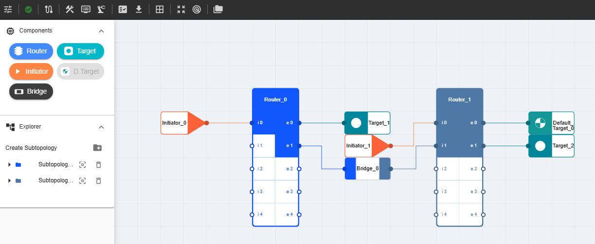
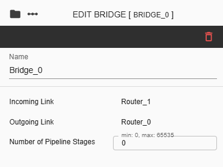

NC-NoC Bridge Configuration
=======================================

Bridges or Pipelines are components used to connect two or more network segments or different types of buses, enabling communication and integration across subtopologies. In iNoCulator, a bridge represents the connection between two routers that belong to different subtopologies, allowing them to operate as part of a unified network.

To Add a Bridge in the Design:
  1. Select the Bridge icon from the Components menu and place it onto the grid.

  2. Connect one end of the bridge to a router by dragging it to any available port.

  3. Connect the other end of the bridge to a port on a different router that belongs to another subtopology.

  4. The topology will then visually reflect a connection between two routers with different subtopologies.

To configure a bridge, click the bridge placed on the grid. This action will open the **Side Panel** on the right, where configuration options are available.

- **Name**  
  The label assigned to the selected bridge. This is a user-editable input field that accepts only **alphanumeric characters** and **underscores** (`_`). Special characters are not allowed.

- **Incoming Link**  
  Specifies the router connection serving as the **incoming link** to the bridge.

- **Outgoing Link**  
  Specifies the router that serves as the **outgoing link** from the bridge.

- **Number of Pipeline Stages**  
  Defines the number of pipeline stages for the bridge. This is a numeric input field with a valid range of **0 to 65,535**.				

