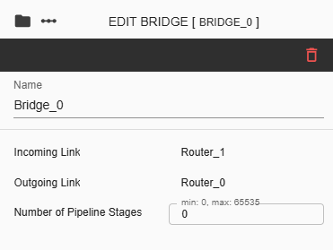

===========================
NC-NoC Bridge Configuration
===========================

Bridges (or Pipelines) are structural components used to link two or more separate network segments or distinct bus protocols, enabling fluid communication and integration across complex subtopologies. 

Within the iNoCulator framework, a bridge specifically establishes a point-to-point connection between two routers residing in **different subtopologies**, binding them into a unified, coherent network fabric.

--------------------------------------------------------------------------------

Adding a Bridge to the Design Canvas
=======================================

.. grid:: 1
   :gutter: 3

   .. grid-item-card:: Step 1: Place the Component
      :class-header: bg-light font-weight-bold

      **Canvas Input**
      
      Select the **Bridge** icon from the left-side Components menu and place it onto your active design grid canvas.

   .. grid-item-card:: Step 2: Attach the Primary Segment
      :class-header: bg-light font-weight-bold

      **Connection 1**
      
      Drag a connection line from one end of the bridge and snap it into any available port on your starting router.

   .. grid-item-card:: Step 3: Bridge the Subtopology Boundary
      :class-header: bg-light font-weight-bold

      **Connection 2**
      
      Drag the opposing end of the bridge and snap it into a port on a different router that **belongs to an entirely separate subtopology**.

   .. grid-item-card:: Step 4: Verify Visual Linkage
      :class-header: bg-light font-weight-bold

      **Validation**
      
      Confirm that the grid canvas visually registers the bridge connection across the shaded subtopology boundaries.
      
      .. image:: images/sample_topology_with_bridge2.png
         :alt: iNoCulator Topology showing cross-subtopology Bridge linkage
         :align: center
         :width: 90%

--------------------------------------------------------------------------------

Side Panel Parameter Definitions
====================================

To customize your bridge latency and routing tags, single-click the bridge component on the canvas grid. This action populates the **Side Panel** workspace on the right side of your screen.

.. list-table:: Bridge Configuration Attributes
   :widths: 30 70
   :header-rows: 1

   * - Configuration Property
     - Rules & Valid Constraints
   * - **Name**
     - The custom system string assigned to this bridge instance. Accepts **alphanumeric characters** and **underscores** (``_``) only. Special symbols and spaces are forbidden.
   * - **Incoming Link**
     - A read-only hardware attribute specifying the exact source router connection serving as the incoming ingress node.
   * - **Outgoing Link**
     - A read-only hardware attribute specifying the exact destination router connection serving as the outgoing egress node.
   * - **Number of Pipeline Stages**
     - A numeric input determining structural registers for timing closure. Valid integer range is **0 to 65,535**.

.. important::
   Increasing the **Number of Pipeline Stages** helps resolve critical path timing violations across long physical distances, but introduces additional clock cycles of latency to packet traversal.
