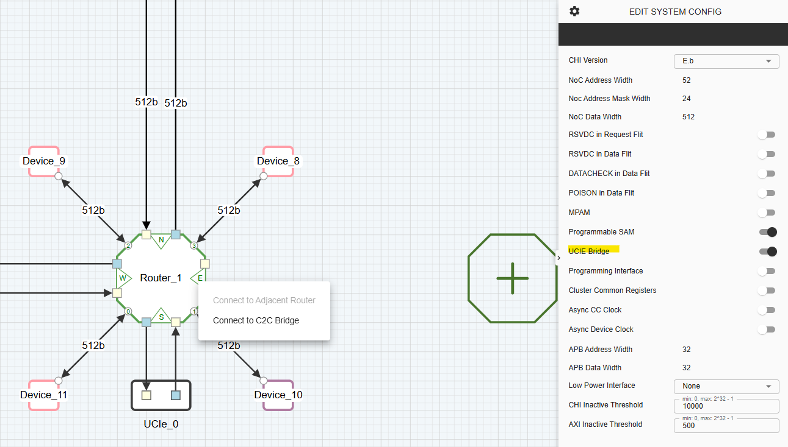
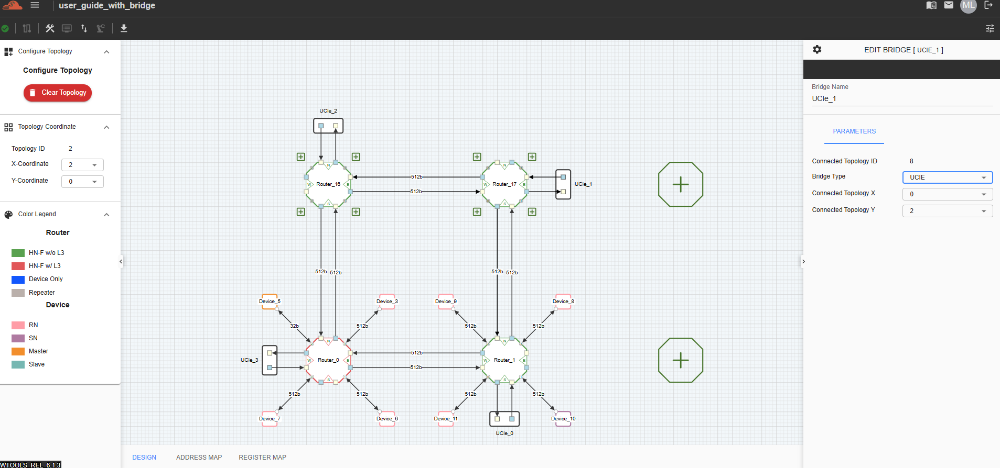
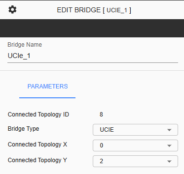

C2C Bridge Configuration 
====================================================

The C2C Bridge, also known as the CHI-to-CPI Bridge, provides seamless protocol conversion between CHI (Coherent Hub Interface) and CPI (Coherent Port Interface) within C-NoC (Cache-Coherent Network-on-Chip) topologies.

**Purpose**
~~~~~~~~~~~~~~~~~~~~~~~~~~~~~~~

- Acts as a translation layer to enable interoperability between components using different coherence protocols.

- Ensures data integrity, protocol compliance, and transaction consistency across interconnected subsystems.

**Key Functions**
~~~~~~~~~~~~~~~~~~~~~~~~~~~~~~~

- Protocol Conversion: Converts CHI requests, responses, and snoop messages into the CPI equivalent, and vice versa.

- Address Mapping Support: Maintains compatibility with the configured Home Node and Subordinate Node Address Maps.

- Cache Coherency: Preserves coherency rules during translation to allow smooth operation between CHI-based clusters and CPI-based devices.

- Scalability: Allows system architects to integrate heterogeneous IP blocks and scale up multi-cluster designs.

**Use in Topology**
~~~~~~~~~~~~~~~~~~~~~~~~~~~~~~~~~~~~~~~~~~~~~~~~~~~

In a C-NoC design:

- The C2C Bridge connects CHI clusters to CPI-based devices or subsystems.

- It ensures traffic between clusters remains synchronized, coherent, and protocol-compliant.

- Designers can configure and visualize the bridge placement within the topology using the Inoculator Web tool.

To add to the canvas, place the mouse on the Interconnect Port or any of the N, E, S, or W ports. This component can only be added in a position where no routers are connected.
Select the 'Connect C2C Bridge' option from the context menu. 

**C-NoC Parameters** 
~~~~~~~~~~~~~~~~~~~~~~~~~~~~~~~~~~~~~~~~~~~~~~~~~~

**Connected Topology ID** - single number used to represent a topology’s position by combining its X and Y coordinates. The ID should be unique within the topology. It is calculated by placing the Y coordinate in the higher bits and the X coordinate in the lower bits using this formula:

  Topology ID = (Y << 2) | X

In simple terms:

  Multiply Y by 4

  Add X

  The result is the Topology ID

  This makes it easy to uniquely identify a position on a small grid (where X ranges from 0 to 3) using just one number.

**Bridge Type** - is a dropdown field where the user will be able to select between UCIE or CXL.

    UCIe (Universal Chiplet Interconnect Express) - A high-speed interconnect for communication between chiplets within a single package.

    CXL (Compute Express Link) – A high-speed interface for communication between processors, memory, and accelerators with cache coherency support.

**Connected Topology X** - is a dropdown field where the user will be able to select from 0 to 3. Represents the column position (left to right). It is stored in the lower bits of the Connected Topology ID.

**Connected Topology Y** - is a dropdown field where the user will be able to select from 0 to 3. Represents the row position (top to bottom). It is stored in the higher bits of the Connected Topology ID.

