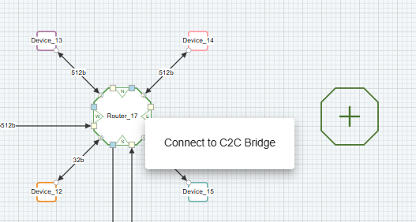
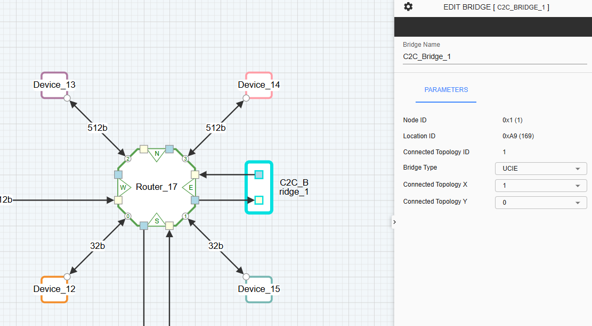
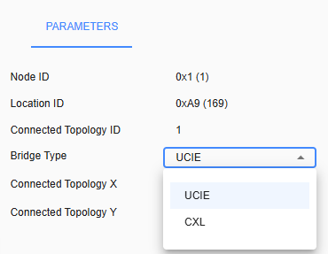

====================================================
C-NoC Bridge Configuration (CHI-to-CPI)
====================================================

The **C2C Bridge** (CHI-to-CPI Bridge) provides protocol conversion between **CHI** (Coherent Hub Interface) and **CPI** (Coherent Port Interface) domains within **C-NoC** (Cache-Coherent Network-on-Chip) topologies. 

It acts as a hardware translation layer to maintain data integrity, protocol compliance, and transaction consistency across heterogeneous subsystems.

--------------------------------------------------------------------------------

Key Architecture Roles
==========================

Protocol Conversion
   Translates CHI requests, responses, and snoop messages into their CPI equivalents, and vice-versa, without breaking cache-coherency rules.

Multi-Cluster Scalability
   Connects coherent CHI compute clusters to CPI-based accelerator devices, enabling architects to scale out complex heterogeneous SoC designs.

--------------------------------------------------------------------------------

Canvas Integration Workflow
=================================

To append a C2C Bridge instance to your architecture canvas:

1. Hover your cursor over an open **Interconnect Port** or any of the cardinal edge ports (**N, E, S, W**). 

.. note::
   The bridge component can only be instantiated at perimeter positions where no existing routers are connected.

2. Right-click to trigger the context menu and select **Connect C2C Bridge**.

--------------------------------------------------------------------------------

C-NoC Protocol & Routing Parameters
========================================

When configuring a C2C Bridge, the side property panel controls structural addressing, coordinate packing, and physical protocol constraints.

.. list-table:: Bridge Property Options & Requirements
   :widths: 25 75
   :header-rows: 1

   * - Parameter Name
     - Functional Profile & Constraints
   * - **Bridge Type**
     - Dropdown selection to define the underlying physical link layer protocol:
       
       * ``UCIe`` *(Universal Chiplet Interconnect Express)* — Dedicated to ultra-low latency, high-density die-to-die chiplet streaming inside a single package.
       * ``CXL`` *(Compute Express Link)* — Tailored for high-speed processor-to-memory expansion or off-chip coherent hardware accelerators.
   * - **Connected Topology X**
     - Dropdown selector range: **0 to 3**. Establishes the grid column position (left-to-right), packed into the lower bits of the Topology ID.
   * - **Connected Topology Y**
     - Dropdown selector range: **0 to 3**. Establishes the grid row position (top-to-bottom), shifted into the higher bits of the Topology ID.
   * - **Connected Topology ID**
     - A single read-only packed numeric value identifying the layout grid location. The engine compresses coordinates by mapping $Y$ to the upper bits and $X$ to the lower bits:
       
       $$\text{Topology ID} = (Y \ll 2) \mid X = (Y \times 4) + X$$

--------------------------------------------------------------------------------

Architectural Identification Schema
======================================

The platform tracks components using two distinct ID metrics to separate hardware routing paths from user-facing layout views:

Node ID (System Hardware Identifier)
   A compact bit-packed value encoding your hierarchical topology details. It enables runtime routing hardware to direct messages efficiently.
   
   $$\text{Structure Format Example: } \{\text{top\_y}, \text{clus\_y}, \text{top\_x}, \text{clus\_x}, \text{port\_direction}\}$$

Location ID (User Interface Reference)
   A human-readable, descriptive coordinate reference label. Unlike the packed **Node ID**, this is utilized strictly inside the UI and validation engine for error parsing and visual tracking.

