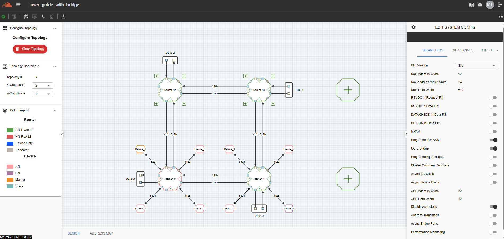
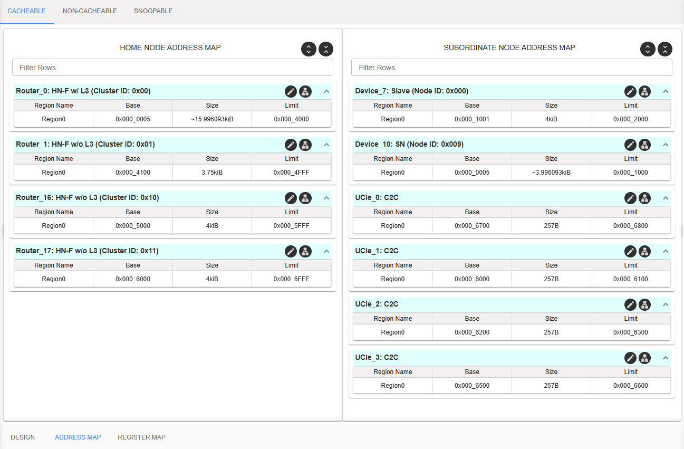
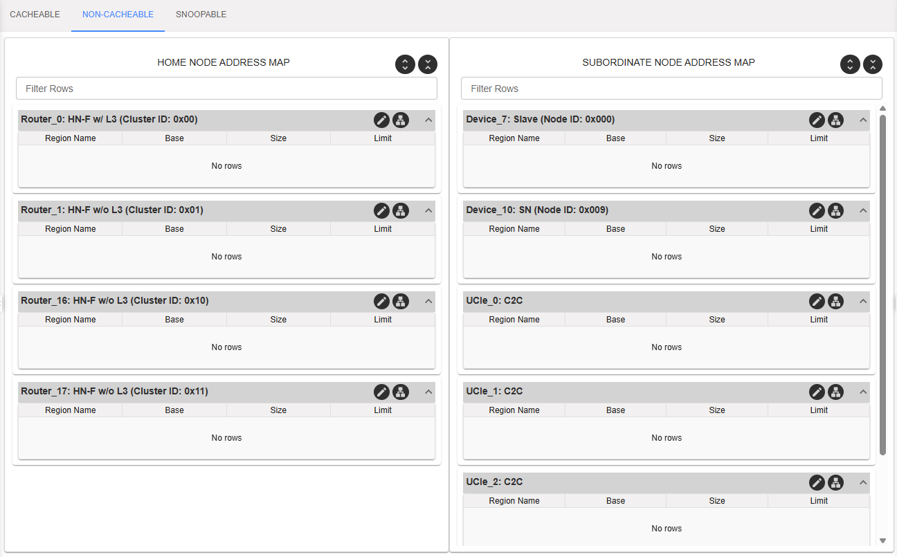
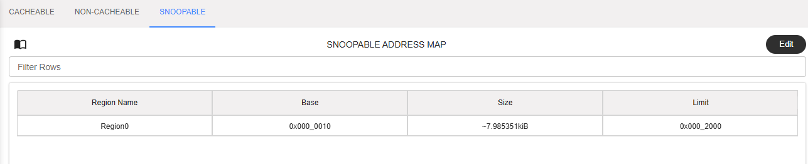
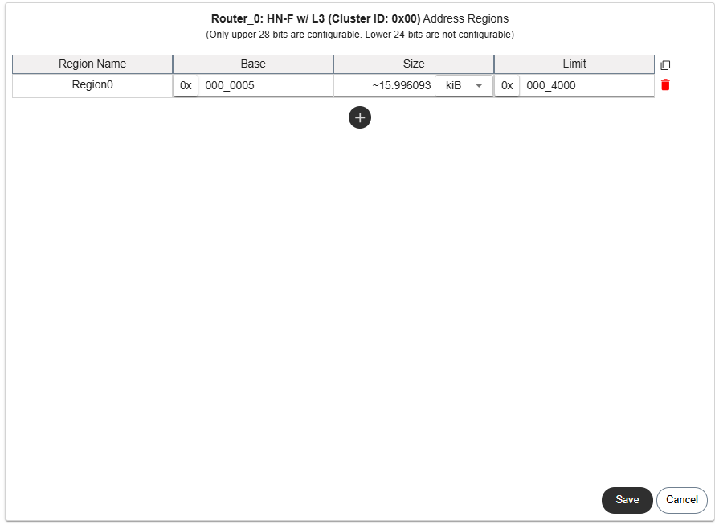
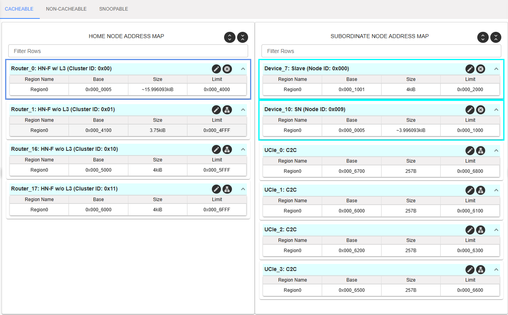

========================================================
C-NoC Address Map
========================================================

The **C-NoC Address Map** framework manages address allocation across three distinct transactional domains: **Cacheable**, **Non-Cacheable**, and **Snoopable** spaces. Memory segments are distributed across local and remote nodes using a specialized architectural layout.

--------------------------------------------------------------------------------

Core Node Mapping Matrix
===========================

.. list-table:: Address Table Mappings & Target Hardware
   :widths: 20 25 35 20
   :header-rows: 1

   * - Map Scope
     - Internal Table Name
     - Target Hardware Endpoints Covered
     - Operational Context
   * - **Cacheable** & **Non-Cacheable**
     - Home Node (HN) Address Map
     - **Routers** (Identified by grid coordinate strings)
     - Local system space owned & managed by current node.
   * - **Cacheable** & **Non-Cacheable**
     - Subordinate Node (SN) Address Map
     - **AXI Slaves**, **CHI SNs**, and **UCIe Bridges**
     - Remote system memory spaces residing in external targets.
   * - **Snoopable**
     - Request Node (RN) Address Map
     - **AXI Masters**
     - Coherey domains monitored for cache-line state changes.

--------------------------------------------------------------------------------

System Hardware Configuration Prerequisites
=================================================

The configuration engine locks editing capabilities unless your hardware blocks are provisioned with specific, compliant protocol roles:

.. list-table:: Configuration Enablement Constraints
   :widths: 35 65
   :header-rows: 1

   * - Selected Table
     - Hard Prerequisites Required to Enable Editing Controls
   * - **Home Node Map**
     - The **Router Type** must be configured explicitly as:
       
       * ``HN-F w/ L3`` (Home Node Fully Coherent with L3 Cache)
       * ``HN-F w/o L3`` (Home Node Fully Coherent without L3 Cache)
       
       *(Device Only and Repeater profiles disable this map)*
   * - **Subordinate Node Map**
     - Target blocks must match one of the following structures:
       
       * **Device Protocol:** ``AXI`` or ``CHI`` **and** **Device Type:** ``Slave`` or ``SN``
       * **Standalone Node Type:** ``UCIe Bridge``
   * - **Request Node Map**
     - Enabled exclusively when at least one active node on the canvas layout grid is provisioned as an **AXI Master**.

--------------------------------------------------------------------------------

Domain Classifications
===========================

### 1. Cacheable Address Map
Defines the memory footprints where caching layers are active. Transactions passing through this space exploit high-speed localized caches to drop multi-hop access latencies.

### 2. Non-Cacheable Address Map
Enforces strong cache-bypass mechanics. Used specifically for memory-mapped I/O (MMIO), system peripherals, and runtime operations demanding direct, unbuffered reads/writes to ensure instantaneous data consistency.

### 3. Snoopable Address Map
Governs regions subject to multi-core cache coherency interventions. The engine places all hardware elements configured as **AXI Masters** into this dedicated Request Node (RN) map.

.. warning::
   **Architectural Overlap Constraint:** All addresses allocated within the **Snoopable/Request Node Address Map** must physically reside within the bounds of your configured **Home Node Address Map** space. Overlapping ranges across these specific maps is structurally expected.

--------------------------------------------------------------------------------

Editing Mechanics & Visual Guidance
=======================================

Clicking **Edit** on a specific layout region, router node, or individual endpoint card launches the granular allocation modal.

Bidirectional Field Syncing
   The allocation table evaluates and locks space parameters via a responsive bidirectional formula:

   * Modifying the **Size** column automatically calculates and inputs the **End Address** boundaries.
   * Modifying the **End Address** box recalculates the **Size** memory range.

Parent Hierarchy Highlighting
   To accelerate manual routing inspections, selecting an allocation row dynamically highlights its master parent **Home Node** or corresponding **Subordinate Node** elements across your active schematic view.

