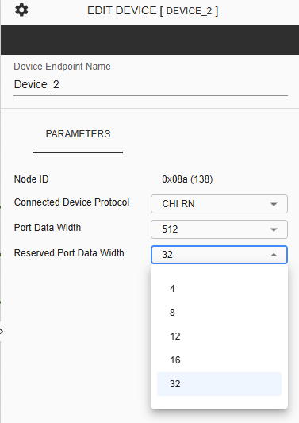
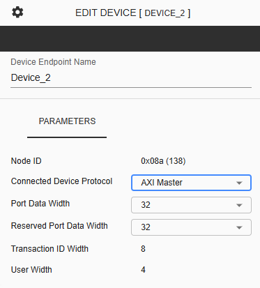
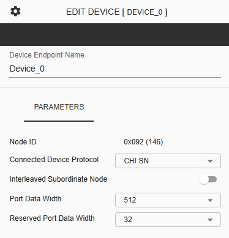
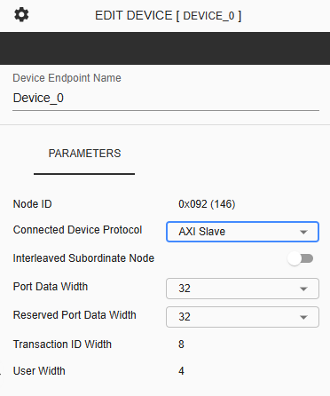

C-NoC Device
===========================================================

**Device Name** - Assigned for the selected device. This is an input field where only alphanumeric characters and underscores are allowed.
  
**Node ID** – This represents the unique identifier of the selected device. 
  
**Connected Device Protocol** – This is a dropdown button where the user can choose between “CHI RN”, "CHI SN", "AXI Master" or “AXI Slave” as the device protocol for the selected device.
  
**Port Data Width** –When the Connected Device Protocol is set to "RN", the parameter allows the user to choose from 128, 256, or 512 representing the Data Bus Width for the device connected to the nth port of the mth cluster. The selected data width will also be visually reflected in the displayed connection to the router.

**Reserved Port Data Width** - This is a dropdown button where the user can choose between 4, 8, 12, 16, or 32 as the Reserved Port Data Width for the selected device, which is reserved for future use in the data flit.

Sample parameters when CHI RN is selected. 

When the Connected Device Protocol is set to AXI Master, the available Port Data Width values will change.

**Port Data Width** – This is a dropdown button where the user can choose between 32, 64, 128, 256, 512 or 1024 as the Data Bus Width for the device connected to the nth port of the mth cluster. Note that the selected data width will be reflected in the displayed connection to the Router.

**Reserved Port Data Width** - This is a dropdown button where the user can choose between 4, 8, 12, 16, or 32 as the Reserved Port Data Width for the selected device, which is reserved for future use in the data flit.

**Transaction ID Width** - This is a display-only parameter showing the ID width of the AXI port connected to the nth port of the mth cluster.

**User Width** - This is a display-only parameter showing the user-defined signal width of the AXI port connected to the nth port of the mth cluster.

Sample parameters when AXI Master is selected. 

When the Connected Device Protocol is set to either CHI SN or AXI Slave, a toggle button will be available to enable or disable the Interleaved Subordinate Node. 

**Interleaved Subordinate Node** - An Interleaved Subordinate Node is a target device that participates in address interleaving. It receives transactions for specific portions of an interleaved address range, allowing memory accesses to be distributed across multiple nodes to improve bandwidth and performance.

