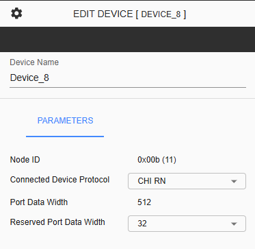
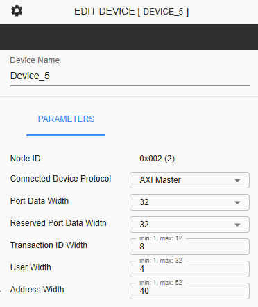
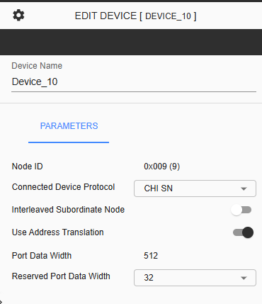
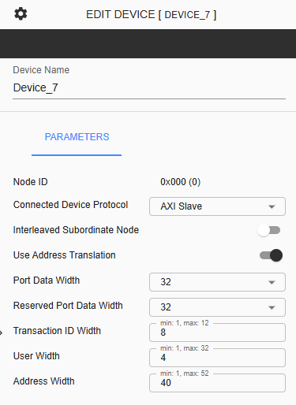

===========================================================
C-NoC Device Configuration
===========================================================

When configuring a device node within the **C-NoC** framework, the side property panel adjusts dynamically to expose relevant hardware fields based on the selected communication protocol.

--------------------------------------------------------------------------------

Baseline Device Attributes
=============================

Regardless of the protocol choice, every device node requires these core layout identifiers:

.. list-table:: Global Device Parameters
   :widths: 25 75
   :header-rows: 1

   * - Parameter Name
     - Validation Constraints & Rules
   * - **Device Name**
     - User-defined string label. Accepts **alphanumeric characters** and **underscores** (``_``) only. Spaces and special characters are forbidden.
   * - **Node ID**
     - A read-only, system-assigned unique hardware identifier mapping the selected node to the interconnect fabric topology.
   * - **Connected Device Protocol**
     - Dropdown menu to set the node's functional protocol layer. Select between: ``CHI RN``, ``CHI SN``, ``AXI Master``, or ``AXI Slave``.

--------------------------------------------------------------------------------

Dynamic Protocol Parameter Spaces
====================================

Selecting a specific protocol type updates your property inspector panel to match the requirements below:

1. CHI Request Node (CHI RN)
----------------------------
Configures the block as a coherent requester (e.g., processor cluster core).

* **Port Data Width** — Dropdown options: ``128``, ``256``, or ``512`` bits. Defines the raw data bus width for the device interface connected to the $n$-th port of the $m$-th cluster. 
* **Reserved Port Data Width** — Dropdown choices: ``4``, ``8``, ``12``, ``16``, or ``32`` bits. Allocates bits in the data flit payload reserved explicitly for future architecture expansions.

.. hint::
   Modifying the **Port Data Width** values triggers a real-time canvas asset redraw, visually widening or narrowing the connection wire running from the device to its target router.

2. AXI Master
-------------
Configures the endpoint as a standard non-coherent bus master master interface.

.. list-table:: AXI Master Interface Configuration Matrix
   :widths: 30 30 40
   :header-rows: 1

   * - Parameter Name
     - Allowed Input Range / Options
     - Target Hardware Mapping
   * - **Port Data Width**
     - ``32``, ``64``, ``128``, ``256``, ``512``, ``1024``
     - Raw data bus width ($m$-th cluster, $n$-th port path). Updates canvas trace thickness.
   * - **Reserved Port Data Width**
     - ``4``, ``8``, ``12``, ``16``, ``32``
     - Future-use bit budgeting inside individual data flit payloads.
   * - **Transaction ID Width**
     - Integers from **1 to 12**
     - Tracks concurrent out-of-order transaction streams across the fabric.
   * - **User Width**
     - Integers from **1 to 32**
     - Custom user-defined sideband signal channel bit allocation width.
   * - **Address Width**
     - Integers from **1 to 52**
     - Absolute physical addressing bit width constraint limits for the system space.

3. Subordinate & Slave Endpoints (CHI SN / AXI Slave)
-----------------------------------------------------
Configures the device node to act as a target memory destination block. Selecting either option unlocks advanced traffic distribution and translation options.

.. list-table:: Target Node Options
   :widths: 30 70
   :header-rows: 1

   * - Toggle Control
     - Functional System Behavior
   * - **Interleaved Subordinate Node**
     - **Toggle Switch.** When enabled, this target device actively joins the fabric's address interleaving matrix. It receives sequential transaction fragments for specific portions of an interleaved range, spreading workloads across target spaces to improve total burst throughput.
   * - **Address Translation**
     - **Toggle Switch.** Enables an inline hardware remapping layer that automatically translates raw incoming user-defined addresses into distinct physical address spaces required by the sub-system layout.

