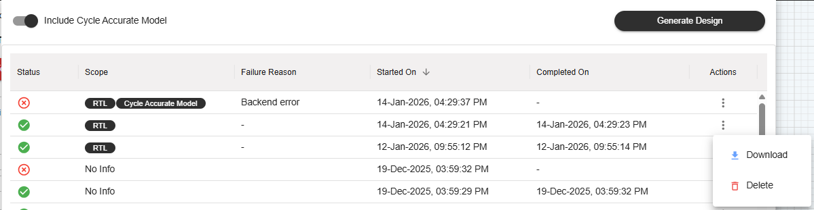

=========================================================
C-NoC Generating RTL and Testbench
=========================================================

The **RTL and Testbench Generation** feature compiles your finalized Coherent-NoC topology into hardware description files and verification environments, allowing you to move from architecture design directly to hardware implementation.

--------------------------------------------------------------------------------

The Generation Workflow
===========================

.. grid:: 1
   :gutter: 4

   .. grid-item-card:: Step 1: Open the Generation Menu
      :class-header: bg-light font-weight-bold

      **Action Bar Trigger**
      
      Locate and click the **Generate RTL** button within the primary top Action Bar to pull up your design compiler panel.
      
      .. image:: images/c-noc_generateRTL_button.png
         :alt: iNoCulator Generate RTL Button Trigger
         :align: center
         :width: 40%

   .. grid-item-card:: Step 2: Configure Cycle-Accurate Simulation (Optional)
      :class-header: bg-light font-weight-bold

      **Compiler Options**
      
      An optional checkbox labeled **Include Cycle Accurate Model** is available. 
      
      * **Tick the checkbox** if you want to bundle a high-fidelity performance simulation model with your source code.
      * **Leave it unticked** to keep the footprint lightweight and skip model synthesis.

   .. grid-item-card:: Step 3: Trigger the Build Process
      :class-header: bg-light font-weight-bold

      **Design Compilation**
      
      Click the final **Generate Design** button to kick off the background compilation process. 
      
      The system will automatically log and display real-time progress timestamps indicating exactly when the synthesis action started and completed.
      
      .. image:: images/c-noc_generateRTL5.png
         :alt: iNoCulator Generation Progress and Timestamp Dashboard
         :align: center
         :width: 90%

   .. grid-item-card:: Additional Item for Internal Users
      :class-header: bg-light font-weight-bold

     The task window interface includes a branch selector component presented in a structured **Grid View** layout, allowing authorized internal users to target and inspect specific code/configuration branches across active sessions.

     Features & Access Control
     -------------------------

     * **Visibility:**
       The branch selection grid is restricted and **visible only to internal users** belonging to authorized groups (`SignatureIP`, `SAdmins`, and designated internal groups). External or standard users will not see this panel.
     * **Default Branch:**
       Upon initial load, the default active cell/selection reflects the active branch configured globally within the **admin page group settings**.
     * **Persistence:**
       Any manual selection made by a user within the grid view is automatically saved to local storage (`localStorage`) to preserve their preference across sessions and window reloads.

     Grid Layout & Configuration Reference
     -------------------------------------

     .. list-table:: Task Window Branch Selector Grid Properties
        :widths: 30 70
        :header-rows: 1

        * - Grid Property
          - Description
        * - **Component Layout**
          - Multi-column card/grid container within the task window control panel.
        * - **Authorized Roles**
          - ``SignatureIP``, ``SAdmins``, internal group members.
        * - **Storage Key**
          - ``task_window_selected_branch``
        * - **Fallback / Default**
          - Admin page group active branch configuration.

     Usage & Grid Interaction
     ------------------------

     When an internal user opens a task window, the grid component performs the following operational flow:

     1. **Permission Check:** Validates if the user session contains internal privileges before rendering the grid view.
     2. **State Initialization:** Reads the preferred branch from storage or falls back to the admin-defined active branch, highlighting the corresponding grid card.
     3. **Event Triggering:** Dispatches a ``taskBranchChanged`` event whenever a user clicks/selects a new branch card in the grid, updating downstream task processes dynamically.

--------------------------------------------------------------------------------

Managing Compiled Build Artifacts
=====================================

Once compilation completes successfully, a new row entry populated with tracking data will map to your history space. 

Each generation record exposes specific controls under the **Action** column:

📥 Download
   Packs the output RTL files, verification testbenches, and optional simulation modules into a structural zip package.

🗑️ Delete
   Permanently wipes the specific build artifact row and cached files from the cloud workspace directory.

.. note::
   **Access Control Notice:** The availability of the **Download** action button is governed by individual team organizational permission structures. Download functionality depends directly on the active license tier assigned to your user group.

C-NoC Output Sub-Directories
----------------------------

.. dropdown:: 📁 Output Tree WITHOUT Cycle Accurate Model (Cache-Coherent NoC)
   :open:

   For coherent (C-NoC) designs, the engine builds out explicit directories containing cache controllers, directory nodes, snoop filters, and CHI/CPI protocol tracking layers.

   .. image:: images/generate_rtl_files_c_noc-without_cycle_accurate.png
      :alt: Extracted Coherent C-NoC folder structure containing CHI/CPI hardware blocks
      :align: center
      :width: 60%
