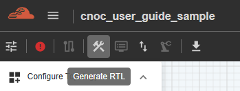
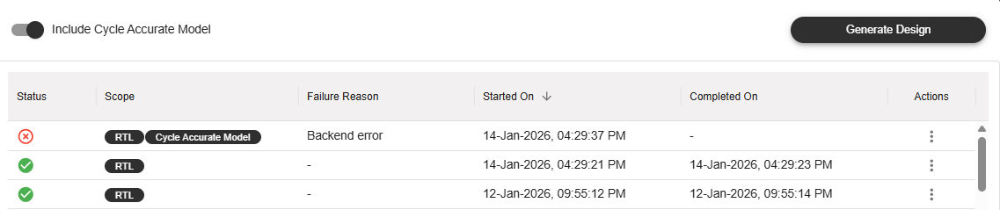

Generating RTL and Testbench (Coherent-NoC)
=========================================================

This feature generates RTL files and a testbench for the created C-NoC topology.
To use it, click the ‘Generate RTL’ button in the Action Bar. An optional checkbox labeled ‘Include Cycle Accurate Model’ allows you to include the model in the generation—tick the checkbox to include it, or leave it unticked to exclude it.

Then, click the ‘Generate Design’ button to start the process. The results, including timestamps for when the action started and completed, will be displayed in the same table.

.. image:: images/c-noc_generateRTL_actions4.png  
  :alt: c-noc_generateRTL_actions
  :align: center

Each result includes an ‘Action’ column, where the user can choose to either ‘Download’ or ‘Delete’ the result. The download option depends on the license assigned to the user’s group.

