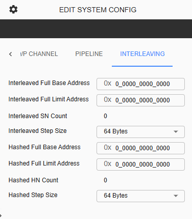

C-NoC Address Interleaving 
==================================================

Coherent NoC Address Interleaving is a feature that distributes memory addresses across multiple target devices (such as memory controllers or slaves) within the Coherent Network-on-Chip (NoC).
Instead of sending all transactions for a continuous address range to a single target, the address space is divided into smaller chunks and interleaved among several targets.

This mechanism helps improve system performance by balancing traffic across multiple devices, enabling parallel access, and reducing bottlenecks in the interconnect. 
As a result, memory bandwidth utilization is increased and overall system efficiency is improved.

User can configure this in System Config > Interleaving tab

**Interleaved Full Base Address** - The starting address of the memory range where address interleaving begins.

**Interleaved Full Limit Address** - The ending address of the memory range where address interleaving is applied.

**Interleaved SN Count** - The number of target nodes (such as slave nodes or memory controllers) that participate in the interleaving. Read-only parameter. This reflects the number of enabled Interleaved SNs in the topology.

**Interleaved Step Size** - The size of each address block before the next block is assigned to the next node in the interleaving sequence. User can select from 64 Bytes, 128 Bytes, 256 Bytes, 512 Bytes, 1 KB, 2KB, or 4KB. 

**Hashed Full Base Address** - The starting address of the memory range where hashed address distribution begins.

**Hashed Full Limit Address** - The ending address of the memory range where hashed address distribution is applied.

**Hashed HN Count** - The number of target nodes that receive transactions when hash-based distribution is used. Read-only parameter. This will reflect how many enabled Hashed Home Node in the topology. 

**Hashed Step Size** - The address block size used as input when calculating how addresses are distributed using the hash function. User can select from 64 Bytes, 128 Bytes, 256 Bytes, 512 Bytes, 1 KB, 2KB, or 4KB. 
