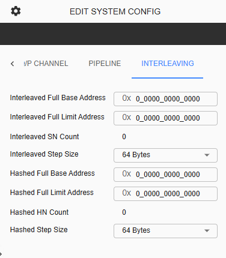

==================================================
C-NoC Address Interleaving
==================================================

**Address Interleaving** distributes memory addresses across multiple target components within the Coherent Network-on-Chip (NoC). Instead of routing a continuous address block to a single memory target, the address space is fragmented into modular chunks and interleaved among several destinations.

This mechanism optimizes system performance by enabling simultaneous parallel memory access, balancing uniform traffic across controllers, and eliminating interconnect bottlenecks.

--------------------------------------------------------------------------------

🛠️ Accessing the Settings Workspace
=====================================

To configure interleaving layouts, navigate to the following path in the property manager:

**System Config** ➔ **Interleaving** tab

--------------------------------------------------------------------------------

🎛️ Mapping Architecture Settings
==================================

The Interleaving panel is split into two primary configuration blocks depending on whether the routing targets are subordinate targets or coherent cache home nodes.

1. Interleaved Subordinate Node (SN) Space
------------------------------------------
Governs address interleaving mapped directly across target devices, such as system memory controllers or peripheral slave units.

.. list-table:: Interleaved SN Parameter Space
   :widths: 30 70
   :header-rows: 1

   * - Parameter Name
     - Functional Profile & Constraints
   * - **Interleaved Full Base Address**
     - The absolute starting boundary address where structural block-level address interleaving begins.
   * - **Interleaved Full Limit Address**
     - The absolute ending boundary address where structural block-level address interleaving stops.
   * - **Interleaved SN Count**
     - **Read-Only.** Reflects the total tally of valid, active target nodes down inside the design topology that have their individual *Interleaved Subordinate Node* toggle enabled.
   * - **Interleaved Step Size**
     - Dropdown block allocation step selector. Defines the footprint size of an individual slice before the routing engine shifts to the next node in line. 
     
       *Options:* ``64 B``, ``128 B``, ``256 B``, ``512 B``, ``1 KB``, ``2 KB``, or ``4 KB``

2. Hashed Home Node (HN) Space
------------------------------
Governs hash-based address distribution mapping across internal cluster Home Nodes to balance internal cache slice lines.

.. list-table:: Hashed HN Parameter Space
   :widths: 30 70
   :header-rows: 1

   * - Parameter Name
     - Functional Profile & Constraints
   * - **Hashed Full Base Address**
     - The starting physical address boundary marking the initiation of the hash distribution algorithm.
   * - **Hashed Full Limit Address**
     - The ending physical address boundary marking the termination of the hash distribution algorithm.
   * - **Hashed HN Count**
     - **Read-Only.** Reflects the total count of operational Home Nodes within your current canvas topology that are actively participating in hash-routing targets.
   * - **Hashed Step Size**
     - Dropdown block size selector used as a primitive input variable when running the hash distribution functions across the interconnect.
     
       *Options:* ``64 B``, ``128 B``, ``256 B``, ``512 B``, ``1 KB``, ``2 KB``, or ``4 KB``
