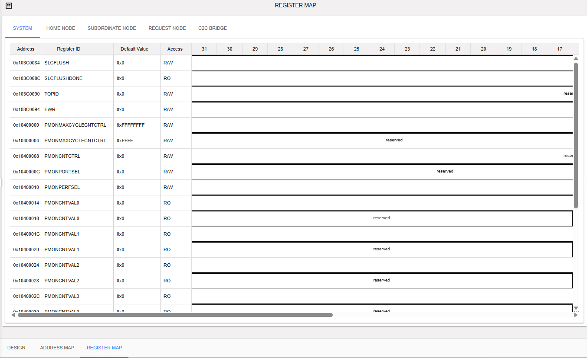
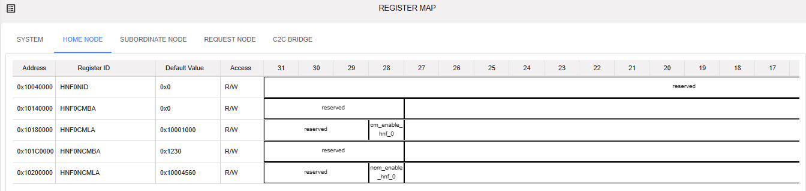
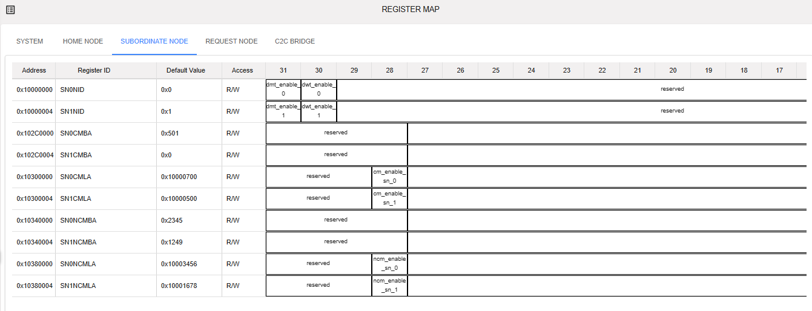
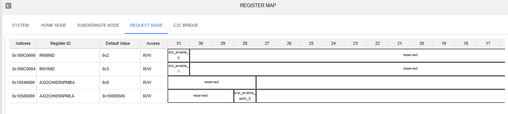
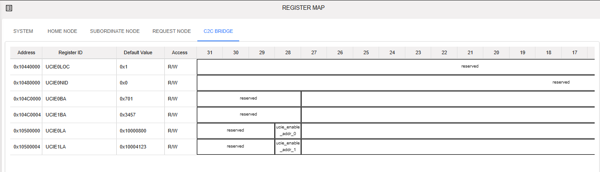

Register Map - Coherent NoC
============================================

The C-NoC Register Map provides a structured view of all registers used in the C-NoC (Configurable Network-on-Chip) system. It allows users to view, configure, and validate register settings for system setup, debugging, and validation.

Structured Register View

  - Displays all registers in an organized hierarchy (by module/block)

  - Groups related registers for easier navigation

To view the Register Map, toggle on the 'Register Map Generation' from C-NoC System Config. Register Map tab should be visible inside the C-NoC Project. 

**System tab** - This will display the registers for Performance Monitor, Recovery and QOS Control, and System Control.

**Home Node** - Registers that define and control the primary (home) node responsible for managing and coordinating system-level operations and data ownership within the network.

**Subordinate Node** - Registers used to configure and monitor secondary nodes that operate under the home node, handling delegated tasks and supporting system scalability.

**Request Node** - Registers that manage transaction or access requests initiated by nodes, including routing, tracking, and arbitration of requests within the system.

**C2C Bridge** - Registers that control and configure the Chip-to-Chip (C2C) bridge interface, enabling communication and data transfer between two separate chips or subsystems.

