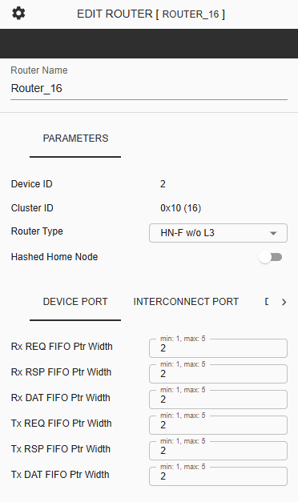
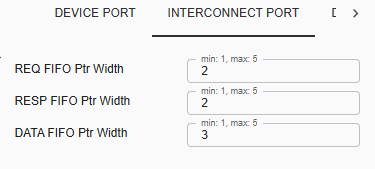
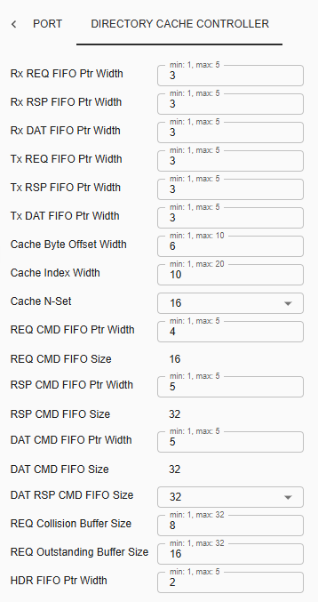
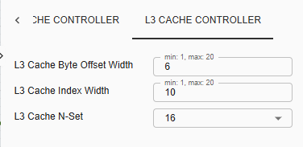

===================================================
C-NoC Router Configuration
===================================================

The **C-NoC Router** properties panel manages identification, messaging queue depths, internal arbitration FIFO sizing, and coherent tracking buffers across individual network nodes.

.. list-table:: Core Identification Attributes
   :widths: 25 75
   :header-rows: 1

   * - Parameter Name
     - Validation Constraints & Architecture Rules
   * - **Device ID**
     - A read-only, system-assigned unique hardware token mapping this instance to the fabric grid layout.
   * - **Cluster ID**
     - Groups specific sets of routers into a local coherency management and routing tracking zone.
   * - **Router Type**
     - Dropdown selector determining the protocol capabilities of this node:
       
       * ``HN-F w/ L3`` — Home Node Fully Coherent with dedicated Directory and L3 Cache.
       * ``HN-F w/o L3`` — Home Node Fully Coherent with dedicated Directory but no L3 Cache.
       * ``Device Only`` — Low-overhead direct endpoint attachment pass-through interface.
       * ``Repeater`` — Pure pipeline register staging hop used for timing closure.
   * - **Hashed Home Node**
     - **Dynamic Toggle.** Visually populates only when **Router Type** is specified as either ``HN-F w/ L3`` or ``HN-F w/o L3``. Enrolls this node in hash-based cache line traffic splitting.

--------------------------------------------------------------------------------

I. Device Port Parameters
============================

*Available for: All Router Types (``HN-F w/ L3``, ``HN-F w/o L3``, ``Device Only``, ``Repeater``)*

This block customizes the pointer widths controlling the queue depth allocations for flits directly interfacing with processor clusters and local bus devices.

.. list-table:: Ingress & Egress Device FIFO Settings
   :widths: 30 20 20 30
   :header-rows: 1

   * - Parameter Name
     - Default Ptr Width
     - Valid Range
     - Hardware Depth Description
   * - **Rx REQ FIFO Ptr Width**
     - ``2``
     - ``1`` to ``5``
     - Inbound Request flit storage allocation.
   * - **Rx RSP FIFO Ptr Width**
     - ``2``
     - ``1`` to ``5``
     - Inbound Response flit storage allocation.
   * - **Rx DAT FIFO Ptr Width**
     - ``2``
     - ``1`` to ``5``
     - Inbound Data flit storage allocation.
   * - **Tx REQ FIFO Ptr Width**
     - ``2``
     - ``1`` to ``5``
     - Outbound Request flit storage allocation.
   * - **Tx RSP FIFO Ptr Width**
     - ``2``
     - ``1`` to ``5``
     - Outbound Response flit storage allocation.
   * - **Tx DAT FIFO Ptr Width**
     - ``2``
     - ``1`` to ``5``
     - Outbound Data flit storage allocation.

--------------------------------------------------------------------------------

II. Interconnect Port Parameters
===================================

*Available for: All Router Types (``HN-F w/ L3``, ``HN-F w/o L3``, ``Device Only``, ``Repeater``)*

Regulates buffer queues managing inter-switch structural traces connecting this router instance to neighboring clusters across the mesh network topology grid.

.. list-table:: Neighboring Cluster Ingress Channels
   :widths: 30 20 20 30
   :header-rows: 1

   * - Parameter Name
     - Default Ptr Width
     - Valid Range
     - Inter-switch Hardware Queue Purpose
   * - **REQ FIFO Ptr Width**
     - ``2``
     - ``1`` to ``5``
     - Incoming inter-cluster network Request buffer depth.
   * - **RESP FIFO Ptr Width**
     - ``2``
     - ``1`` to ``5``
     - Incoming inter-cluster network Response buffer depth.
   * - **DATA FIFO Ptr Width**
     - ``2``
     - ``1`` to ``5``
     - Incoming inter-cluster network Data flit buffer depth.

--------------------------------------------------------------------------------

III. Directory Cache Controller
==================================

*Available for: Home Node Profiles (``HN-F w/ L3``, ``HN-F w/o L3``)*

Configures internal channels, hash parameters, tracking arrays, and state collision limits for maintaining coherent system consistency loops.

Internal Channel Arbitration Queues
-----------------------------------
Tracks post-arbitration flit staging before feeding entries into the central cache logic.

.. list-table:: Internal Channel Arbitration Arrays
   :widths: 30 20 20 30
   :header-rows: 1

   * - Parameter Name
     - Default Ptr Width
     - Valid Range
     - Operational Domain
   * - **Rx REQ / RSP / DAT FIFO Ptr Width**
     - ``3``
     - ``1`` to ``5``
     - Inbound channels from internal arbiter to CC port.
   * - **Tx REQ / RSP / DAT FIFO Ptr Width**
     - ``3``
     - ``1`` to ``5``
     - Outbound channels moving from CC port to fabric.

Directory Mapping & Associativity Rules
---------------------------------------
Enforces physical mapping dimensions for cache lookup routines. Associativity sizing follows a power-of-two formula:

$$\text{Sizing Factor} = 2^k \quad \text{where } 0 \le k \le 5$$

.. list-table:: Cache Index Space Array Geometry
   :widths: 30 20 20 30
   :header-rows: 1

   * - Parameter Name
     - Default Value
     - Valid Range
     - Mapping Definition / Choices
   * - **Cache Byte Offset Width**
     - ``6``
     - ``1`` to ``10``
     - Byte offset portion of a physical address line.
   * - **Cache Index Width**
     - ``10``
     - ``1`` to ``20``
     - Row index indicator for $N$-way set lookups.
   * - **Cache N-Set**
     - ``16``
     - Dropdown
     - Select from: ``1``, ``2``, ``4``, ``8``, ``16``, or ``32`` sets.

Pipeline Sizing & Flight Trackers
---------------------------------

.. list-table:: In-Flight Command Pipelines and Trackers
   :widths: 35 20 20 25
   :header-rows: 1

   * - Parameter Name
     - Default Ptr Width
     - Structural Size
     - Configuration State
   * - **REQ CMD FIFO**
     - ``4`` *(Range: 1–5)*
     - **16**
     - Pointer configurable; size locked.
   * - **RSP CMD FIFO**
     - ``5`` *(Range: 1–5)*
     - **32**
     - Pointer configurable; size locked.
   * - **DAT CMD FIFO**
     - ``5`` *(Range: 1–5)*
     - **32**
     - Pointer configurable; size locked.
   * - **DAT RSP CMD FIFO Size**
     - *N/A*
     - **32**
     - Dropdown: ``2``, ``4``, ``8``, ``16``, or ``32``.
   * - **REQ Collision Buffer Size**
     - *N/A*
     - **8** *(Range: 1–32)*
     - Buffers conflicting address lines.
   * - **REQ Outstanding Buffer Size**
     - *N/A*
     - **16** *(Range: 1–32)*
     - Limits maximum parallel pending transactions.
   * - **HDR FIFO Ptr Width**
     - ``2`` *(Range: 1–5)*
     - *Dynamic*
     - Regulates individual header packet buffers.

--------------------------------------------------------------------------------

IV. L3 Cache Controller Settings
===================================

*Available for: ``HN-F w/ L3`` exclusive profiles*

Provides a high-capacity last-level cache layer within the home node structure. Just like the baseline directory parameters, its set mapping layout sizes scale according to the exponential function:

$$\text{L3 Sets} = 2^k \quad \text{where } 0 \le k \le 5$$

.. list-table:: L3 Physical Address Array Constraints
   :widths: 35 20 20 25
   :header-rows: 1

   * - Parameter Name
     - Default Value
     - Valid Range
     - Geometry Allocation Role
   * - **L3 Cache Byte Offset Width**
     - ``6``
     - ``1`` to ``20``
     - L3 block address offset bit width.
   * - **L3 Cache Index Width**
     - ``10``
     - ``1`` to ``20``
     - Total entry line depth of a single cache block.
   * - **L3 Cache N-Set**
     - ``16``
     - Dropdown
     - Dropdown list options: ``1``, ``2``, ``4``, ``8``, ``16``, or ``32``.
