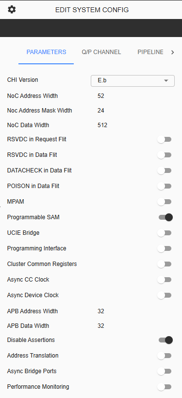
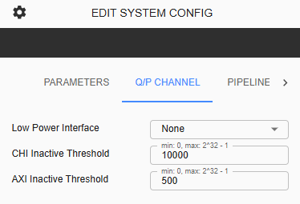
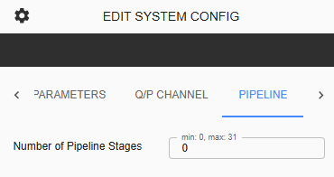
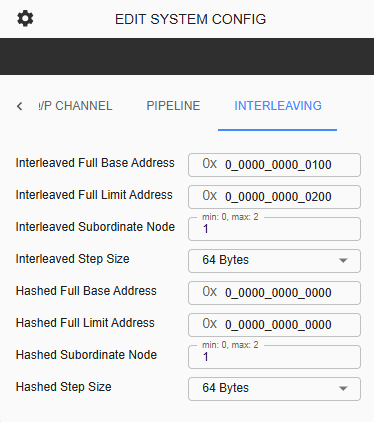

C-NoC System Config
=================================================

Parameters Tab
----------------------------------------------

**CHI Version** – Version of AMBA CHI protocol to use for the whole C-NoC. Default is E.b. User can choose from E.b and B. 

**NoC Address Width** – This is display-only parameter showing the Address width of the NoC. The default value is 52, equivalent to ADDR_WIDTH

**NoC Address Mask Width** – This display-only parameter showing the Address Mask Width of NoC. Default value is 24, equivalent to NUM_IGNORE_LOWBITS. 

**NoC Data Width** – This is display-only parameter showing the Data Width. Default value is 512. 

**RSVDC in Request Flit** – Toggle button to enable/disable CNOC_SYSCONFIG_REQ_RSVDC_ENABLED. Default is disabled. 

**RSVDC in Data Flit** – Toggle button to enable/disable CNOC_SYSCONFIG_DAT_RSVDC_ENABLED. Default is disabled. 

**DATACHECK in Data Flit** – Toggle button to enable/disable CNOC_SYSCONFIG_DAT_DATACHECK_ENABLED. Default is disabled. 

**POISON in Data Flit** – Toggle button to enable/disable CNOC_SYSCONFIG_DAT_POISON_ENABLED. Default is disabled. 

**MPAM** – Toggle button to enable/disable CNOC_SYSCONFIG_REVEB_MPAM_ENABLED. Default is disabled and only available using CHI Version – E.b. 

**UCIe Bridge** - Toggle button to be able to add C-NoC Bridge on the grid. 

**Programmable SAM** – Toggle button to enable/disable PROGRAMMABLE_SAM. Default is enabled. 

**Programming Interface** – Toggle button to enable/disable SIG_PROG_AXI_LITE. Default is disabled. 

**Cluster Common Registers** – Toggle button to enable/disable SIG_INCLUDE_CLST_COMMONREG. Default is disabled. 

**Async CC Clock** – Toggle button to enable/disable SIG_PROC_ASYNCCLK. Default is disabled. 

**Async Device Clock** – Toggle button to enable/disable SIG_CC_ASYNCCLK. Default is disabled. 

**APB Address Width** - Display only parameter. Default value is 32. 

**APB Data Width** - Display only parameter. Default value is 32. 

**Disable Assertions** - Default toggle button is enabled, means Assertion is disabled. When disabled, assertion is enabled. 

**Address Translation** - Default toggle button is disabled. User is allowed to enable this parameter. 

**Async Bridge Ports** - Default toggle button is disabled. User is allowed to enable this parameter. 

**Performance Monitoring** - Default toggle button is disabled. User is allowed to enable this parameter. 

Q/P Channel Tab
--------------------------------------------------

**Low Power Interface** - This item is a dropdown selection where user is allowed to choose from 'None', 'Q-Channel' and 'P-Channel' as the Topology Low Power Interface. 

**P-Channel Width** - Display only parameter. Default value is 1. This parameter will only be visible once 'P-Channel' is selected. 

**P-Channel Active Width** - Display only parameter. Default value is 1. This parameter will only be visible once 'P-Channel' is selected. 

**CHI Inactive Threshold** - Default is 10000, minimum input is 0 and maximum input is up to 2^32-1 

**AXI Inactive Threshold** - Default is 500, minimum input is 0 ad maximum input is up to 2^32-1

Pipeline Tab
-----------------------------------------------

**Number of Pipeline Stages** - This input field determine the number of stages assigned for the whole C-NoC Topology. 

Interleaving Tab
-----------------------------------------------

**Interleaved Full Base Address** - This input field determine the Interleaved Base Address. This should consists 13 hex characters. Base Address should not be more than Limit Address. 

**Interleaved Full Limit Address** - This input field determine the Interleaved Limit Address. This should consists 13 hex characters. Limit Address should not be less than Base Address. 

**Interleaved Subordinate Node** - This is an input field. Maximum number allowed depends on the number of SN or Slave on the topology. 

**Interleaved Step Size** - Default is 64 bytes. User can configure from 64 bytes, 128 bytes, 256 bytes, 512 bytes, 1kb, 2kb, or 4kb. 

**Hashed Full Base Address** - This input field determine the Hashed Base Address. This should consists 13 hex characters. Base Address should not be more than Limit Address. 

**Hashed Full Limit Address** - This input field determine the Hashed Limit Address. This should consists 13 hex characters. Limit Address should not be less than Base Address. 

**Hashed Subordinate Node** - This is an input field. Maximum number allowed depends on the number of SN or Slave on the topology. 

**Hashed Step Size** - Default is 64 bytes. User can configure from 64 bytes, 128 bytes, 256 bytes, 512 bytes, 1kb, 2kb, or 4kb. 

