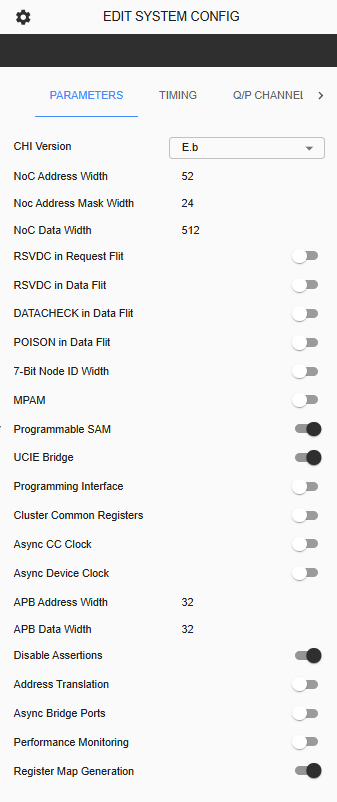
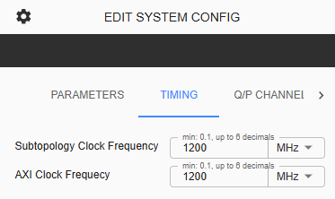
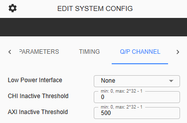
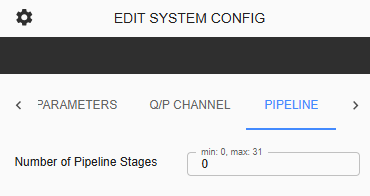
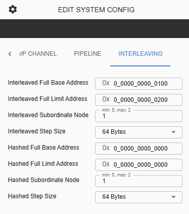

=================================================
C-NoC System Configuration
=================================================

The **C-NoC System Config** properties panel governs global architectural definitions, timing domains, power throttling interfaces, pipeline staging, and memory distribution boundaries for the entire network-on-chip topology.

--------------------------------------------------------------------------------

📊 I. Parameters Tab
====================

This tab sets the global baseline protocol parameters, bit-widths, sideband signal features, and clock boundaries across the fabric.

Architecture Parameters & Controls
----------------------------------

.. list-table:: System Bus Widths & Global Protocols
   :widths: 30 20 20 30
   :header-rows: 1

   * - Parameter Name
     - Default Value
     - Setting Type
     - Hardware Context & Protocol Rules
   * - **CHI Version**
     - ``E.b``
     - Dropdown
     - Select between AMBA CHI versions ``E.b`` and ``B``.
   * - **NoC Address Width**
     - ``52``
     - **Read-Only**
     - Maps directly to systemic ``ADDR_WIDTH``.
   * - **NoC Address Mask Width**
     - ``24``
     - **Read-Only**
     - Maps directly to ``NUM_IGNORE_LOWBITS``.
   * - **NoC Data Width**
     - ``512``
     - **Read-Only**
     - Defines global baseline network data path thickness.
   * - **APB Address / Data Width**
     - ``32`` / ``32``
     - **Read-Only**
     - Fixed specifications for the APB peripheral bus.

Functional Sideband & Feature Toggles
-------------------------------------

.. list-table:: Protocol Option Flags
   :widths: 35 20 45
   :header-rows: 1

   * - Parameter Control Name
     - Default State
     - Underlying Hardware Flag / Constraint
   * - **RSVDC in Request Flit**
     - Disabled
     - Toggles ``CNOC_SYSCONFIG_REQ_RSVDC_ENABLED``.
   * - **RSVDC in Data Flit**
     - Disabled
     - Toggles ``CNOC_SYSCONFIG_DAT_RSVDC_ENABLED``.
   * - **DATACHECK in Data Flit**
     - Disabled
     - Toggles ``CNOC_SYSCONFIG_DAT_DATACHECK_ENABLED``.
   * - **POISON in Data Flit**
     - Disabled
     - Toggles ``CNOC_SYSCONFIG_DAT_POISON_ENABLED``.
   * - **7Bit Node ID Width**
     - Disabled
     - Toggles ``nodeIdWidth7BitEnabled``.
   * - **MPAM**
     - Disabled
     - Enters ``CNOC_SYSCONFIG_REVEB_MPAM_ENABLED``. **Only available if CHI Version is set to E.b.**
   * - **UCIe Bridge**
     - Disabled
     - When enabled, allows placement of C-NoC Bridges on the topology canvas grid.
   * - **Programmable SAM**
     - **Enabled**
     - Toggles ``PROGRAMMABLE_SAM``.
   * - **Programming Interface**
     - Disabled
     - Toggles ``SIG_PROG_AXI_LITE`` for runtime memory configuration.
   * - **Cluster Common Registers**
     - Disabled
     - Toggles inclusion of ``SIG_INCLUDE_CLST_COMMONREG``.
   * - **Async CC / Device Clock**
     - Disabled
     - Respectively toggles ``SIG_PROC_ASYNCCLK`` and ``SIG_CC_ASYNCCLK``.
   * - **Disable Assertions**
     - **Enabled**
     - **Note:** Turning this toggle *OFF* actively *enables* SystemVerilog RTL assertions.
   * - **Address Translation**
     - Disabled
     - Toggles remapping capabilities for local target address offset bounds.
   * - **Async Bridge Ports**
     - Disabled
     - Unlocks asynchronous clock-domain crossing bridge elements.
   * - **Performance Monitoring**
     - Disabled
     - Provisions hardware telemetry tracking units throughout the routers.

--------------------------------------------------------------------------------

⏱️ II. Timing Tab
=================

Configures the decoupled clock domains providing timing reference points across boundaries.

* **Subtopology Clock Frequency** — Defines the baseline operation speed for the main internal routing switches.
* **AXI Clock Frequency** — Establishes the speed of external AXI interfaces handling transaction bridging.

--------------------------------------------------------------------------------

💤 III. Q/P Channel Tab
=======================

Manages hardware low-power handshake protocols for progressive power-gating or clock-throttling when interfaces stay idle.

.. list-table:: Power Throttling Parameter Space
   :widths: 30 25 45
   :header-rows: 1

   * - Parameter Name
     - Default Value
     - Behavioral Rules & Constraints
   * - **Low Power Interface**
     - ``None``
     - Dropdown selector. Choose between ``None``, ``Q-Channel``, or ``P-Channel``.
   * - **P-Channel Width**
     - ``1``
     - **Read-Only.** Visually populates *only* when Low Power Interface is set to ``P-Channel``.
   * - **P-Channel Active Width**
     - ``1``
     - **Read-Only.** Visually populates *only* when Low Power Interface is set to ``P-Channel``.
   * - **CHI Inactive Threshold**
     - ``10000``
     - Integer range: **0 to $2^{32}-1$**. Inactivity clock cycle count trigger threshold.
   * - **AXI Inactive Threshold**
     - ``500``
     - Integer range: **0 to $2^{32}-1$**. Inactivity clock cycle count trigger threshold.

--------------------------------------------------------------------------------

🏗️ IV. Pipeline Tab
====================

* **Number of Pipeline Stages** — Numeric user field specifying the total register pipeline delay depths distributed across the unified C-NoC topology to meet physical floorplanning timing closure constraints.

--------------------------------------------------------------------------------

🧩 V. Interleaving Tab
======================

Defines the master baseline boundaries for structural data distribution. Base addresses must match a exact hexadecimal layout width.

.. list-table:: Interleaved vs. Hashed Allocation Matrix
   :widths: 20 40 40
   :header-rows: 1

   * - Boundary Target
     - Block Interleaved SN Parameters
     - Hash-Distributed HN Parameters
   * - **Full Base Address**
     - **Constraint:** Must be exactly **13 Hex Characters**. Cannot exceed Limit Address.
     - **Constraint:** Must be exactly **13 Hex Characters**. Cannot exceed Limit Address.
   * - **Full Limit Address**
     - **Constraint:** Must be exactly **13 Hex Characters**. Cannot be less than Base Address.
     - **Constraint:** Must be exactly **13 Hex Characters**. Cannot be less than Base Address.
   * - **Subordinate Node**
     - Max count capped by active quantity of enabled Subordinate Nodes inside topology.
     - Max count capped by active quantity of enabled Subordinate Nodes inside topology.
   * - **Step Size Options**
     - **Default:** ``64 Bytes``. Choose from: ``64 B``, ``128 B``, ``256 B``, ``512 B``, ``1 KB``, ``2 KB``, or ``4 KB``.
     - **Default:** ``64 Bytes``. Choose from: ``64 B``, ``128 B``, ``256 B``, ``512 B``, ``1 KB``, ``2 KB``, or ``4 KB``.
