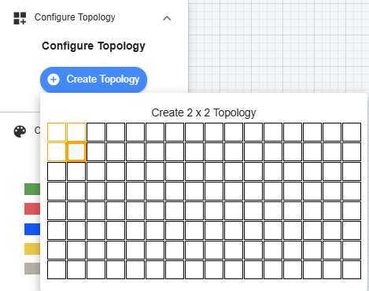
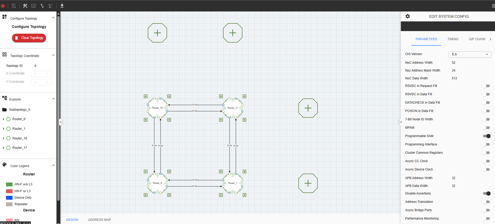
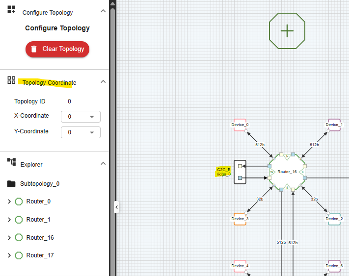

=======================================================
C-NoC Topology Workspace
=======================================================

The **C-NoC Topology** canvas provides an interactive graphical layout to instantiate, route, scale, and manipulate your Coherent Network-on-Chip structural floorplan.

--------------------------------------------------------------------------------

Grid Initialization
=======================

Before placing functional hardware, you must define the structural matrix dimensions of your baseline mesh network using the left-side controller panel.

* **Columns** — Defines the total number of vertical routing channels in the topology grid.
* **Rows** — Defines the total number of horizontal routing channels in the topology grid.
* **Configure Topology** — Generates the clean mesh layout matrix on your active canvas area based on your input parameters.

--------------------------------------------------------------------------------

Canvas Interactive Manipulations
====================================

Modify your network architecture using these grid mechanics and context actions:

.. grid:: 1
   :gutter: 3

   .. grid-item-card:: I. Appending Core Devices
      :class-header: bg-light font-weight-bold

      Click the **"+" button** on the perimeter edges of any router block to attach a processing element or memory target node. Once attached, click the node to open its individual configuration properties.
      
      .. image:: images/c_noc-add_device2.png
         :alt: Appending a hardware endpoint to a router boundary port
         :align: center
         :width: 70%

   .. grid-item-card:: II. Adding Mesh Switch Routers
      :class-header: bg-light font-weight-bold

      Expand your routing mesh manually by clicking the **"+" button** located on the top or right side of any active router node.
      
      .. image:: images/cnoc_add_router.png
         :alt: Expanding the routing mesh graph with an extra switch node
         :align: center
         :width: 70%

   .. grid-item-card:: III. Deleting a Router Block
      :class-header: bg-light font-weight-bold

      Right-click any router node and select **Delete Component** from the context menu. 
      
      .. warning::
         This is a cascading action. Deleting a router permanently pulls down all of its directly attached endpoint devices and its associated channel routing traces. A modal window will prompt you to confirm before the compiler runs the deletion sweep.
      
      .. image:: images/c_noc-delete_router_confirmation2.png
         :alt: Destruction warning prompt for router deletion
         :align: center
         :width: 80%

   .. grid-item-card:: IV. Clearing the Canvas
      :class-header: bg-light font-weight-bold

      To reset your design back to a blank project slate, click the red **Clear Topology** button inside the left configuration panel. This purges all structural mesh graphs from the canvas.
      
      .. image:: images/c_noc-clear_topology.png
         :alt: Clear Topology execution layout action
         :align: center
         :width: 40%

--------------------------------------------------------------------------------

Interconnect and Bridging Routines
======================================

.. grid:: 1
   :gutter: 3

   .. grid-item-card:: V. Instantiate a Chip-to-Chip Bridge
      :class-header: bg-light font-weight-bold

      To map an off-die link, right-click an open **Interconnect Port** on any perimeter switch node and select **Connect to C2C Bridge**. A protocol translation block will populate on that port boundary.
      
      For deep-dive register details and protocol parameters, see: :doc:`C-NoC C2C Bridge <c2cbridge>`.
      
      .. image:: images/cnoc_add_bridge.png
         :alt: Instantiating a C2C translation link block on a perimeter channel
         :align: center
         :width: 70%

   .. grid-item-card:: VI. Delete a Directional Trace Link
      :class-header: bg-light font-weight-bold

      Inter-switch routing traces are handled directional per-hop. To break a link between adjacent routers, right-click directly onto the connection arrow and select **Delete Connection**.
      
      .. image:: images/c-noc_delete-a-connection2.png
         :alt: Isolating and removing an active directional inter-switch connection link
         :align: center
         :width: 70%

   .. grid-item-card:: VII. Connect to Adjacent Router
      :class-header: bg-light font-weight-bold

      To restore or forge an explicit new routing link across two adjacent mesh switches, right-click an unassigned **Interconnect Port** and select **Connect to Adjacent Router**. The engine will snap a new trace line to the nearest coordinate match.
      
      *(Note: This control item stays locked if the targeted path is already coupled to a valid channel trace)*
      
      .. image:: images/c-noc_connect-to-adjacent-router2.png
         :alt: Canvas link auto-snapping to the nearest valid neighbor block
         :align: center
         :width: 70%

--------------------------------------------------------------------------------

Topology Coordinates & Die Placement
==============================================

The Topology Coordinates inspector controls the exact macro grid placement properties of subtopology arrays across your package substrate.

.. important::
   **Prerequisite Dependency Constraint:** Coordinate parameters are locked and read-only by default. They switch to an editable input state **only** after an active **UCIe Bridge** component has been instantiated within your network layout design.

To map and register coordinates:
1. Append an active bridge component along your subtopology boundary edge port.
2. Enter your relative macro alignment parameters directly into the **Connected Topology X** and **Connected Topology Y** numeric fields.

This maintains your global floorplanning organization, ensuring cross-die packets map accurately when running system-level multi-chiplet validations.

