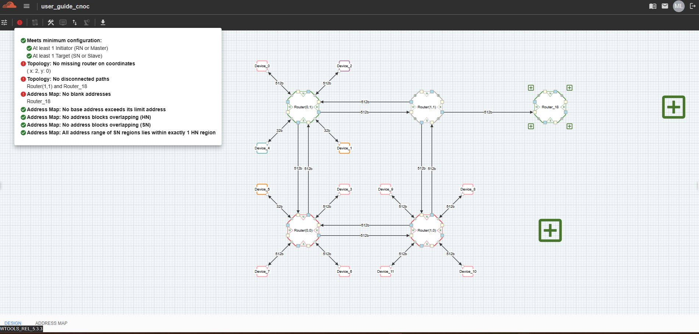

C-NoC Topology Validation 
=================================

The C-NoC Topology Validation feature ensures that the designed Cache-Coherent Network-on-Chip (C-NoC) topology is correctly configured and compliant with protocol, address mapping, and connectivity requirements.

**Purpose**

- Detects inconsistencies in address map assignments across Home and Subordinate nodes.

- Verifies protocol compatibility between interconnected components (e.g., CHI, CPI, or via C2C Bridges).

- Confirms that all routers, links, and devices are properly connected.

- Identifies missing or overlapping address ranges that could cause runtime conflicts.

**Key Benefits**

- Provides early error detection before simulation or hardware implementation.

- Improves system reliability by enforcing topology rules.

- Supports scalability, ensuring large multi-cluster designs remain consistent.

**User Interaction**

- Validation results are displayed in the tool with warnings and errors clearly highlighted.

- Each message links to the relevant component or connection for quick resolution.

- Users can iteratively correct and re-validate until the topology passes all checks.

Validations
---------------------------------

1. Meets minimum configuration 

  - Ensures the topology satisfies the required baseline setup before validation.

2. Topology: No Missing router on coordinates
  
  - Verifies that all coordinate points in the topology have the required routers. Incomplete mesh will be validated.

3. Topollgy: No disconnected paths
  
  - Confirms that all routers and devices are connected, with no isolated components. All connections should be in both directions, no incomplete connections. 

4. Address Map: No blank addresses

  - Checks that all address ranges are defined and not left empty.

5. Address Map: No base address exceeds its limit address

  - Validates that each base address is smaller than or equal to its corresponding limit address.

6. Address Map: No address blocks overlapping (HN)

  - Ensures that Home Node address ranges do not overlap with each other.

7. Address Map: No address blocks overlapping (SN)

  - Ensures that Subordinate Node address ranges do not overlap with each other.

8. Address Map: All address range of SN regions lies within exactly 1 HN region

  - Validates that each Subordinate Node address range is fully contained within a single Home Node region.

