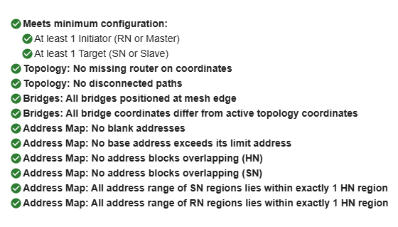

=================================
C-NoC Topology Validation
=================================

The **C-NoC Topology Validation** engine checks your Cache-Coherent Network-on-Chip layout against protocol rules, address mapping bounds, and physical grid connectivity requirements. 

Running a validation check isolates design implementation flaws before they progress downstream to synthesis, simulation, or hardware generation stages.

--------------------------------------------------------------------------------

Evaluation Architecture
==========================

Purpose
   * **Inconsistency Detection:** Pinpoints flawed address map splits between Home (HN) and Subordinate (SN) nodes.
   * **Protocol Auditing:** Confirms protocol compliance across linked IP blocks (such as CHI or AXI targets mapping through a C2C Bridge).
   * **Graph Verification:** Scans the layout to ensure no dead-ends, unidirectional traces, or orphaned nodes exist.
   * **Conflict Prevention:** Detects blank bounds or overlapping memory footprints that cause deadlocks or routing exceptions at runtime.

System Interaction
   Validation logs populate directly inside the report manager panel. Structural warnings and fatal errors are clearly highlighted. Click any error line item to highlight and jump to the problematic node or trace line on your canvas grid workspace for quick troubleshooting.

--------------------------------------------------------------------------------

Standard Validation Test Routines
====================================

The compiler evaluates the active layout schema against 11 strict structural rules. Every criteria must clear to move forward with RTL compilation.

.. list-table:: C-NoC Validation Rules Matrix
   :widths: 5 35 60
   :header-rows: 1

   * - ID
     - Validation Domain Group
     - Rule Description & Passing Evaluation Criteria
   * - **1**
     - Minimum Configuration
     - Verifies the network topology layout matches the minimum node initialization criteria before running deeper checks.
   * - **2**
     - Topology: Missing Routers
     - Evaluates layout coordinates to ensure no missing interior switches exist inside your defined mesh boundaries.
   * - **3**
     - Topology: Disconnected Paths
     - Ensures all router and device channels feature **bidirectional traces**. Unidirectional channels or isolated sub-graphs fail this check.
   * - **4**
     - Bridges: Mesh Edge
     - Confirms that all Chip-to-Chip (C2C) bridges link exclusively to perimeter ports on the edge of the router grid layout.
   * - **5**
     - Bridges: Coordinates Unique
     - Evaluates all external tracking IDs to ensure every cross-die Macro Topology ID is completely unique.
   * - **6**
     - Address Map: Empty Fields
     - Scans tables to ensure all address bounds are allocated and that no fields are left blank.
   * - **7**
     - Address Map: Value Consistency
     - Validates that every base register start address maps to a value less than or equal to its corresponding limit address field ($Base \le Limit$).
   * - **8**
     - Address Map: HN Overlaps
     - Guarantees that separate Home Node (HN) memory allocation zones do not collide or share overlapping address ranges.
   * - **9**
     - Address Map: SN Overlaps
     - Guarantees that separate Subordinate Node (SN) memory target allocations do not overlap with each other.
   * - **10**
     - Address Map: SN Nesting Bounds
     - Validates that every configured Subordinate Node address range is completely enclosed inside the physical footprint of exactly **one** parent Home Node region.
   * - **11**
     - Address Map: RN Nesting Bounds
     - Validates that every configured Request Node (RN) snoop address range is completely enclosed inside the footprint of exactly **one** parent Home Node region.

.. tip::
   If the validation engine reports nesting errors (Rules 10 or 11), open the **Address Map Space** panel and check that your child SN/RN address ranges do not accidentally spill past the boundary lines of your primary HN domain block.
