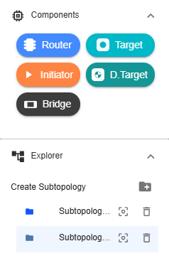
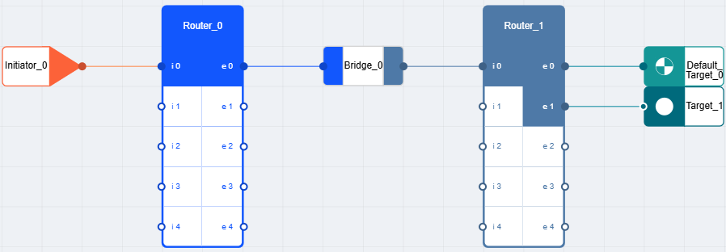

NC-NoC Topology
==============================================================
  2. Components and Explorer

**Router** – A device that connects two or more other devices and manages communication between them.

**Initiator** – A device that initiates transactions by sending read or write commands to a target.

**Target** – A device that responds to commands such as data read or write operations.

**Bridge** – A device that connects two different subtopology.  

**D. Target** – A default target device.

**Subtopology** – component that separates two different topologies. This is represented as a folder in iNoCulator.

