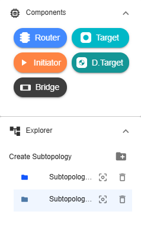
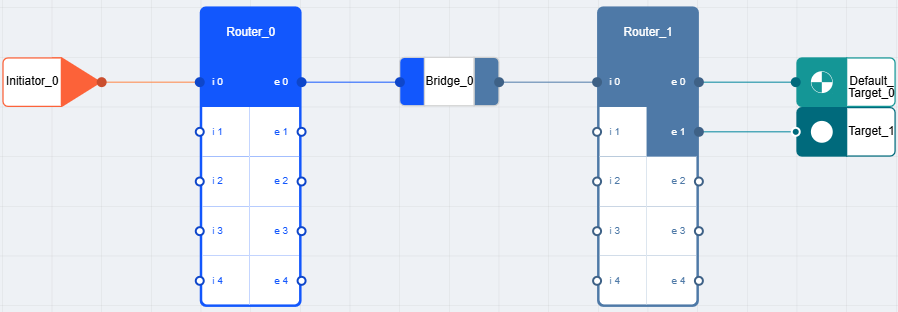

==============================================================
Components and Explorer Panels
==============================================================

The **Components** panel and **Project Explorer** work together to help you build and organize your Network-on-Chip (NoC) design. The Components panel houses the physical hardware blocks you drop onto the design canvas, while the Explorer panel displays the hierarchical tree arrangement of your network segments.

--------------------------------------------------------------------------------

Design Canvas Hardware Components
====================================

These structural building blocks can be dragged directly from the panel onto the design grid to assemble your interconnect fabric:

.. list-table:: Canvas Component Toolset
   :widths: 25 75
   :header-rows: 1

   * - Element Name
     - Functional Profile & Simulation Behavior
   * - **Router**
     - A core networking device that connects multiple switching paths. It dynamically routes flit traffic based on targeted address maps and routing algorithms.
   * - **Initiator**
     - An active master device block (e.g., CPU, DSP, or DMA engine) that generates and drives read/write transaction commands across the network fabric.
   * - **Target**
     - A passive slave node destination block (e.g., memory controller or peripheral) that listens for, processes, and responds to incoming operational commands.
   * - **Bridge**
     - A dedicated protocol or timing conversion block that connects separate subtopologies, translating signals cleanly across the boundary.
   * - **D. Target**
     - *Default Target.* A catch-all, fallback slave destination node that automatically intercepts and handles traffic routing exceptions when an unmapped address is requested.

--------------------------------------------------------------------------------

Project Explorer & Subtopology Tracking
==========================================

As your network design scales up, managing hundreds of routers on a single canvas becomes difficult. The tool resolves this by grouping related sections into modular layers.

Subtopology Block
   A structural container used to isolate separate network segments or different clock domains. 
   
   Within the **iNoCulator Project Explorer tree**, subtopologies are visually organized as folders. Grouping elements this way allows you to hide or show complex design layers, keeping your workspace clean and organized.

