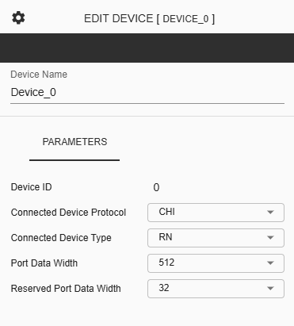
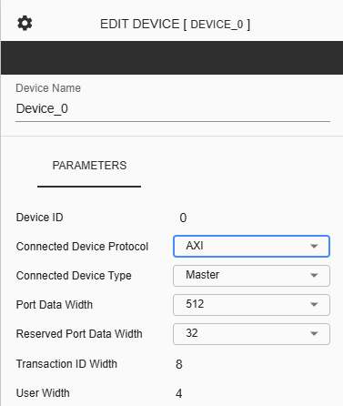

Configure Device (Coherent NoC)
===========================================================

**Device Name** - Assigned for the selected device. This is an input field where only alphanumeric characters and underscores are allowed.
  
**Device ID** – This represents the unique identifier of the selected device. 
  
**Connected Device Protocol** – This is a dropdown button where the user can choose between “CHI” or “AXI” as the device protocol for the selected device.
  
**Connected Device Type** – This is a dropdown button where the user can choose between “RN” or “SN” as the device type for the selected device.
  
**Port Data Width** – This is a dropdown button where the user can choose between 128, 256, or 512 as the Data Bus Width for the device connected to the nth port of the mth cluster. Note that the selected data width will be reflected in the displayed connection to the Router.

**Reserved Port Data Width** - This is a dropdown button where the user can choose between 4, 8, 12, 16, or 32 as the Reserved Port Data Width for the selected device, which is reserved for future use in the data flit.

**Connected Device Protocol** – This is a dropdown button where the user can choose between “CHI” or “AXI” as the device protocol for the selected device.

**Connected Device Type** - This is a dropdown button where the user can choose between "Master" or "Slave" as the device type for the selected device.

**Port Data Width** – This is a dropdown button where the user can choose between 128, 256, or 512 as the Data Bus Width for the device connected to the nth port of the mth cluster. Note that the selected data width will be reflected in the displayed connection to the Router.

**Reserved Port Data Width** - This is a dropdown button where the user can choose between 4, 8, 12, 16, or 32 as the Reserved Port Data Width for the selected device, which is reserved for future use in the data flit.

**Transaction ID Width** - This is a display-only parameter showing the ID width of the AXI port connected to the nth port of the mth cluster.

**User Width** - This is a display-only parameter showing the user-defined signal width of the AXI port connected to the nth port of the mth cluster.

