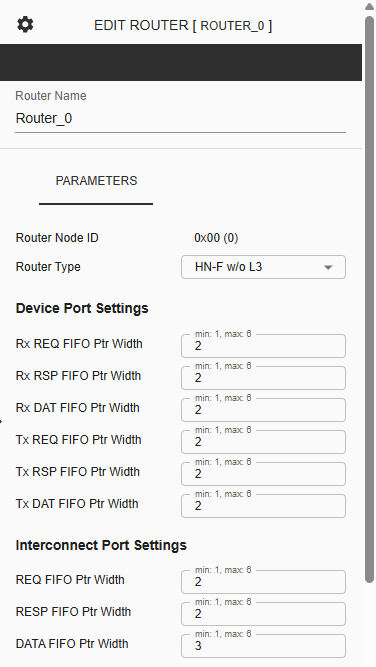
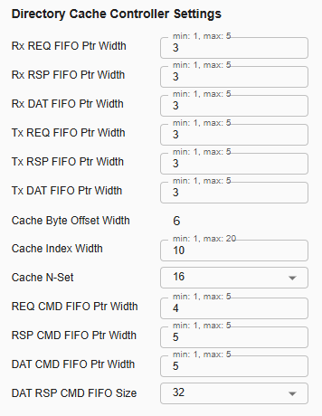

Configuring C-NoC Router
===================================================

**Device ID** – This represents the unique identifier of the selected device.

**Router Type** – This is a dropdown parameter which router type to be used on the selected component. User can choose between 'Repeater', 'HN-F w/ L3', 'HN-F w/o L3', or 'Device Only'. 

**Device Port Settings (Available in router type 'HN-F w/ L3', 'HN-F w/o L3', ‘Device Only’ and ‘Repeater’)**

**RX REQ FIFO Ptr Width** – This Pointer width to indicate depth of input request flit buffer at processor port of the NoC. Default value is 2, and user can choose from 1 to 6 as the width. 

**Rx RSP FIFO Ptr Width** – This Pointer width to indicate depth of input response flit buffer at processor port of the NoC. Default value is 2, and user can choose from 1 to 6 as the width. 

**Rx DAT FIFO Ptr Width** – This Pointer width to indicate depth of input data flit buffer at processor port coming of the NoC. Default value is 2, and user can choose from 1 to 6 as the width. 

**Tx REQ FIFO Ptr Width** – This Pointer width to indicate depth of output request flit buffer at the processor port of the NoC. Default value is 2, and user can choose from 1 to 6 as the width. 

**Tx RSP FIFO Ptr Width** – This Pointer width to indicate depth of output response flit buffer at the processor port of the NoC. Default value is 2, and user can choose from 1 to 6 as the width. 

**Tx DAT FIFO Ptr Width** – This Pointer width to indicate depth of output data flit buffer at the processor port of the NoC. Default value is 2, and user can choose from 1 to 6 as the width. 

**Interconnect Port Settings (Available in router type 'HN-F w/ L3', 'HN-F w/o L3', ‘Device Only’, and ‘Repeater’)**

**REQ FIFO Ptr Width** – This Pointer width to indicate depth of input request flit buffer to receive flits from neighboring cluster. Default value is 2, and user can choose from 1 to 6 as the width. 

**RESP FIFO Ptr Width** – This Pointer width to indicate depth of input response flit buffer to receive flits from neighboring cluster. Default value is 2, and user can choose from 1 to 6 as the width.

**DATA FIFO Ptr Width** – This Pointer width to indicate depth of input data flit buffer to receive flits from neighboring cluster. Default value is 3, and user can choose from 1 to 6 as the width.
	
**Directory Cache Controller Settings (Available in router type 'HN-F w/ L3', 'HN-F w/o L3')**

**Rx REQ FIFO Ptr Width** – This Pointer width to indicate buffer depth to hold input request flit coming to CC port from internal channel after arbitration between multiple sources. Default value is 3, and user can choose from 1 to 5 as the width. 

**Rx DAT FIFO Ptr Width** – This Pointer width to indicate buffer depth to hold input data flit coming to CC port from internal channel after arbitration between multiple sources. Default value is 3, user can choose from 1 to 5 as the width. 

**Rx RSP FIFO Ptr Width** – This Pointer width to indicate buffer depth to hold input response flit coming to CC port from internal channel after arbitration between multiple sources. Default value is 3, user can choose from 1 to 5 as the width.

**Tx REQ FIFO Ptr Width** – This Pointer width of output request flit buffer coming from CC Port to internal channel. Default value is 3, user can choose from 1 to 5 as the width.

**Tx DAT FIFO Ptr Width** – This Pointer width of output data flit buffer coming from CC Port to internal channel. Default value is 3, user can choose from 1 to 5 as the width.

**Tx RSP FIFO Ptr Width** – This Pointer width of output response flit buffer coming from CC Port to internal channel. Default value is 3, user can choose from 1 to 5 as the width.

**Cache Byte Offset Width** – This Byte offset of the cacheable physical address for 64 Byte cache line. Default value is 6 and this parameter is display-only. 

**Cache Index Width** – This Index of the cacheable physical address. 2k indicates the depth of a single cache memory in N-way set associative cache mapping scheme. Default value is 10, user can choose from 1 to 20 as the width.

**Cache N-Set** – This Number of sets in N-way set associative cache mapping scheme. Number of sets is determined as 2k such that 0 ≤ k ≤ 5. This is a dropdown parameter with a selection of 1, 2, 4, 8, 16, or 32. Default value is 16.

**REQ CMD FIFO Ptr Width** – This FIFO Pointer width for request flit waiting to be fed to controller pipeline process.  Default value is 4, user can choose from 1 to 5 as the width.

**RSP CMD FIFO Ptr Width** – This FIFO Pointer width for response flit waiting to be fed to controller pipeline process. Default value is 5, user can choose from 1 to 5 as the width.

**DAT CMD FIFO Ptr Width** – This FIFO Pointer width for data response waiting to be fed to controller pipeline process. Data response is generated from data flit coming from RN (processor). Default value is 5, user can choose from 1 to 5 as the width.

**DAT RSP CMD FIFO Size** – This FIFO depth for memory response waiting to be fed to controller pipeline process. Memory response is generated from data flit coming from Memory IO/L3. This is a dropdown parameter with a selection of 2, 4, 8, 16, or 32. Default value is 32.

**L3 Cache Controller Settings (Available in router type 'HN-F w/ L3')**

**L3 Cache Byte Offset Width** – This Byte offset of the cacheable physical address for 64 Byte cache line for L3. Default value is 6, user can choose from 1 to 20 as the width.

**L3 Cache Index Width** – This Index of the cacheable physical address. 2k indicates the depth of a single cache memory in N-way set associative cache mapping scheme for L3. Default value is 10, user can choose from 1 to 20 as the width.

**L3 Cache N-Set** – This Number of sets in N-way set associative cache mapping scheme for L3 cache. Number of sets is determined as 2k such that 0 ≤ k ≤ 5. This is a dropdown parameter with a selection of 1, 2, 4, 8, 16, or 32. Default value is 16.

