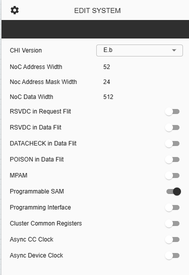
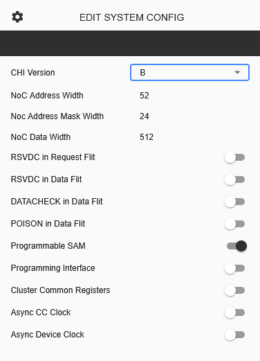

Configuring C-NoC System Parameters
===========================================

**CHI Version** – Version of AMBA CHI protocol to use for the whole C-NoC. Default is E.b. User can choose from E.b and B. 

**NoC Address Width** – This is display-only parameter showing the Address width of the NoC. The default value is 52, equivalent to ADDR_WIDTH

**NoC Address Mask Width** – This display-only parameter showing the Address Mask Width of NoC. Default value is 24, equivalent to NUM_IGNORE_LOWBITS. 

**NoC Data Width** – This is display-only parameter showing the Data Width. Default value is 512. 

**RSVDC in Request Flit** – Toggle button to enable/disable CNOC_SYSCONFIG_REQ_RSVDC_ENABLED. Default is disabled. 

**RSVDC in Data Flit** – Toggle button to enable/disable CNOC_SYSCONFIG_DAT_RSVDC_ENABLED. Default is disabled. 

**DATACHECK in Data Flit** – Toggle button to enable/disable CNOC_SYSCONFIG_DAT_DATACHECK_ENABLED. Default is disabled. 

**POISON in Data Flit** – Toggle button to enable/disable CNOC_SYSCONFIG_DAT_POISON_ENABLED. Default is disabled. 

**MPAM** – Toggle button to enable/disable CNOC_SYSCONFIG_REVEB_MPAM_ENABLED. Default is disabled and only available using CHI Version – E.b. 

**Programmable SAM** – Toggle button to enable/disable PROGRAMMABLE_SAM. Default is enabled. 

**Programming Interface** – Toggle button to enable/disable SIG_PROG_AXI_LITE. Default is disabled. 

**Cluster Common Registers** – Toggle button to enable/disable SIG_INCLUDE_CLST_COMMONREG. Default is disabled. 

**Async CC Clock** – Toggle button to enable/disable SIG_PROC_ASYNCCLK. Default is disabled. 

**Async Device Clock** – Toggle button to enable/disable SIG_CC_ASYNCCLK. Default is disabled. 

