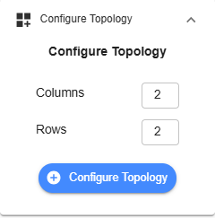
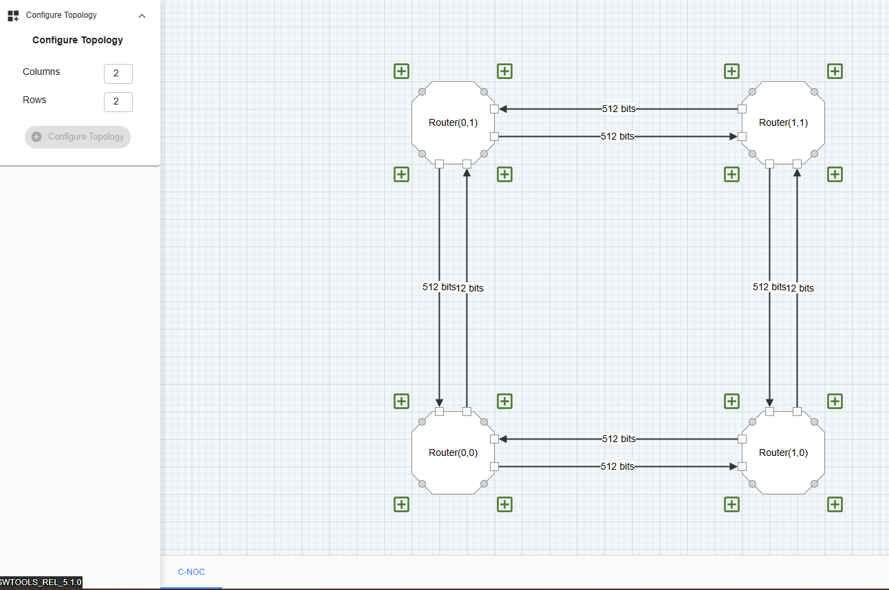

Configure Topology
=======================================================

**Columns** – This represents the number of columns in the Coherent NoC topology

**Rows** – This represents the number of rows in the Coherent NoC topology

**Configure Topology** – This button confirms the creation of a Coherent NoC topology. Once the user clicks it, the topology will be generated on the grid based on the configured number of columns and rows.

To add a device, click the “+” button on the edge of a Router Device. Each Router and Device can be configured.

