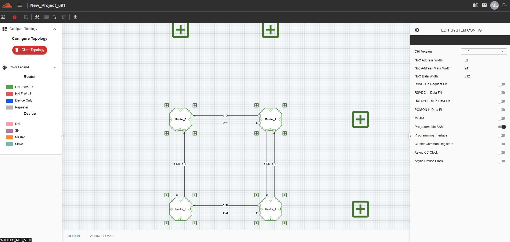

Configure C-NoC Topology
=======================================================

.. image:: images/c_noc-configure_topology2.png
  :alt: c_noc-configure_topology
  :align: center

**Columns** – This represents the number of columns in the Coherent NoC topology

**Rows** – This represents the number of rows in the Coherent NoC topology

**Configure Topology** – This button confirms the creation of a Coherent NoC topology. Once the user clicks it, the topology will be generated on the grid based on the configured number of columns and rows.

Adding a Device 
~~~~~~~~~~~~~~~~~~~~~~~~~~~~~~~~~~~~~
Click the “+” button located on the edge of a Router or Device to add a new connection or component.
Each Router and Device in the diagram can be individually configured to match the required system setup

.. image:: images/c_noc-add_device.png
  :alt: c_noc-add_device
  :align: center

Adding a Router
~~~~~~~~~~~~~~~~~~~~~~~~~~~~~~~~~~~~~
Click the “+” button located on the right or top side of any Router device to add a new router.

.. image:: images/c_noc-add_router.png
  :alt: c_noc-add_router
  :align: center

Deleting a Router
~~~~~~~~~~~~~~~~~~~~~~~~~~~~~~~~~~~~~
From any selected router, right-click on the component to open the context menu and choose "Delete Component".
This action will remove:

- The selected router

- All connected devices

- All associated connections

A confirmation message will appear, asking the user to confirm before proceeding with the deletion. 

.. image:: images/c_noc-delete_router_confirmation.png
  :alt: c_noc-delete_router_confirmation
  :align: center

Clearing the Topology
~~~~~~~~~~~~~~~~~~~~~~~~~~~~~~~~~~~~~~~
To remove all components and start a new design, click the red "Clear Topology" button located on the left panel.

.. image:: images/c_noc-clear_topology.png
  :alt: c_noc-clear_topology
  :align: center

