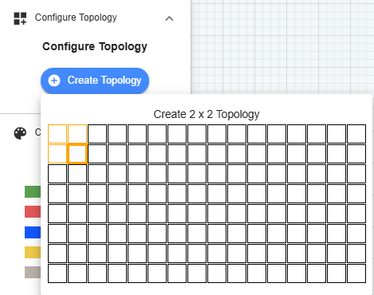
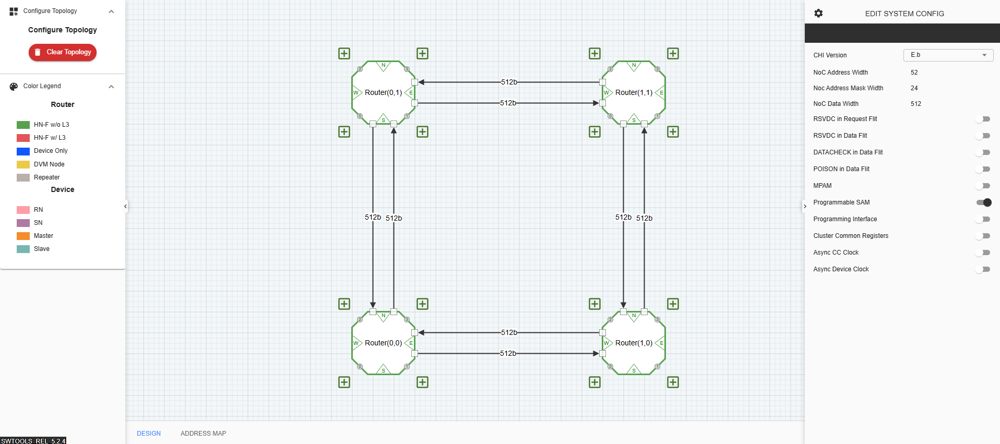
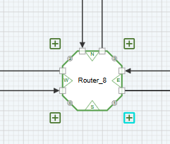
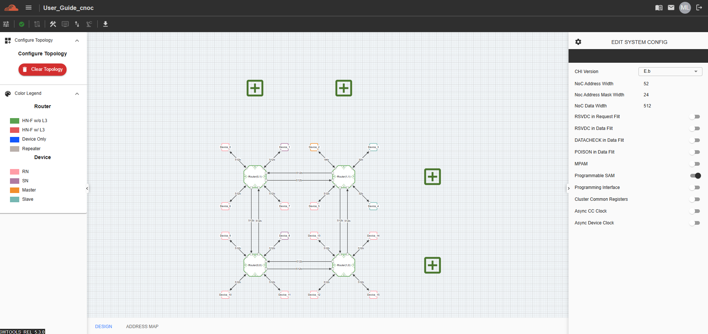
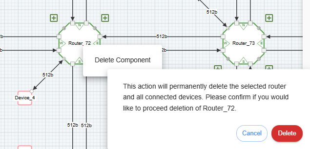
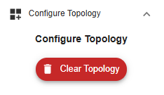

Configure C-NoC Topology
=======================================================

**Columns** – This represents the number of columns in the Coherent NoC topology

**Rows** – This represents the number of rows in the Coherent NoC topology

**Configure Topology** – This button confirms the creation of a Coherent NoC topology. Once the user clicks it, the topology will be generated on the grid based on the configured number of columns and rows.

Adding a Device 
~~~~~~~~~~~~~~~~~~~~~~~~~~~~~~~~~~~~~
Click the “+” button on the edge of a Router Device. Each Router and Device can be configured.

Adding a Router
~~~~~~~~~~~~~~~~~~~~~~~~~~~~~~~~~~~~~
Click the "+" button on the right and top part of any Router device. 

Deleting a Router
~~~~~~~~~~~~~~~~~~~~~~~~~~~~~~~~~~~~~
From any of the router selected, right click from the component and context menu will appaer "Delete Component". This will delete the Router, devices connected and connection. A confirmation message will appear if the user wish to proceed. 

Clear a Topology
~~~~~~~~~~~~~~~~~~~~~~~~~~~~~~~~~~~~~~~
To clear the entire topology and start a new one, click the red 'Clear Topology' button on the left panel. 

