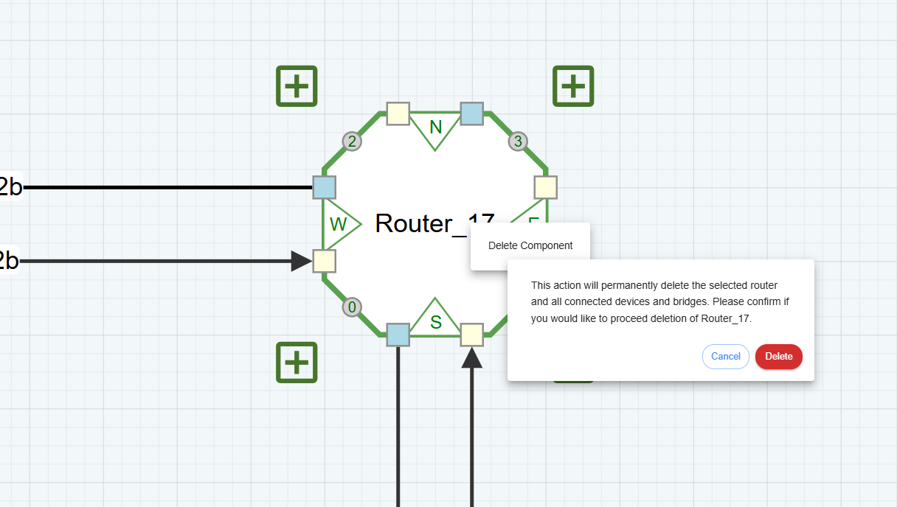
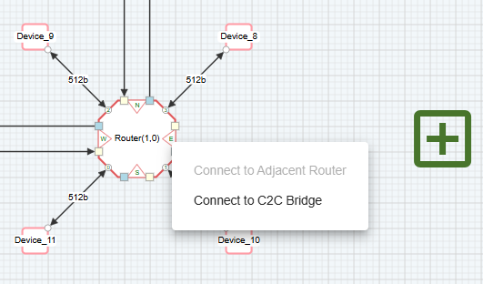

Configure C-NoC Topology
=======================================================

.. image:: images/c_noc-configure_topology2.png
  :alt: c_noc-configure_topology
  :align: center

**Columns** – This represents the number of columns in the Coherent NoC topology

**Rows** – This represents the number of rows in the Coherent NoC topology

**Configure Topology** – This button confirms the creation of a Coherent NoC topology. Once the user clicks it, the topology will be generated on the grid based on the configured number of columns and rows.

Adding a Device 
~~~~~~~~~~~~~~~~~~~~~~~~~~~~~~~~~~~~~
Click the “+” button located on the edge of a Router or Device to add a new connection or component.
Each Router and Device in the diagram can be individually configured to match the required system setup

Adding a Router
~~~~~~~~~~~~~~~~~~~~~~~~~~~~~~~~~~~~~
Click the “+” button located on the right or top side of any Router device to add a new router.

Deleting a Router
~~~~~~~~~~~~~~~~~~~~~~~~~~~~~~~~~~~~~
From any selected router, right-click on the component to open the context menu and choose "Delete Component".
This action will remove:

- The selected router

- All connected devices

- All associated connections

A confirmation message will appear, asking the user to confirm before proceeding with the deletion. 

Clearing the Topology
~~~~~~~~~~~~~~~~~~~~~~~~~~~~~~~~~~~~~~~
To remove all components and start a new design, click the red "Clear Topology" button located on the left panel.

.. image:: images/c_noc-clear_topology.png
  :alt: c_noc-clear_topology
  :align: center

Connect to C2C Bridge
~~~~~~~~~~~~~~~~~~~~~~~~~~~~~~~~~~~~~
This button is placed in the Interconnect Port of each Router. To add a C2C Bridge, right-click on any Interconnect Port and select Connect to C2C Bridge. A new C2C Bridge will then appear in the selected Router.

For more details about this, redirect to this page: `C-NoC C2C Bridge <c2cbridge.html>`_

Delete a Connection
~~~~~~~~~~~~~~~~~~~~~~~~~~~~~~~~~~~~~
This function allows the deletion of a connection between two routers. Deleting a connection is done per direction. To delete a connection, right-click on any router connection to open the context menu, then select ‘Delete Connection’ to proceed.

Connect to Adjacent Router 
~~~~~~~~~~~~~~~~~~~~~~~~~~~~~~~~~~~~~
This button is placed in the Interconnect Port of each Router. To add a connection from one router to another, right-click on any Interconnect Port and select Connect to Adjacent Router. A new connection will then appear to the nearest available router in the canvas.
This item will only be available to Routers that do not have a Router Connection.

