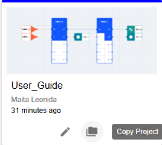
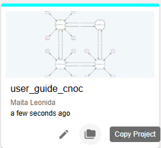

Copy Project
======================================================
This feature allows users to create a new project by duplicating an existing one.
It helps save time by eliminating the need to recreate the entire project when only a portion needs modification.

The Copy Project function also supports copying projects owned by other users. Once copied, ownership of the new project is transferred to the user who performed the copy.

.. image:: images/copy_project2.png
  :alt: copy_project2
  :align: center

Limitations:

  - Only the first letters should be in uppercase.

  - Use alphanumeric characters only, including ñ and Ñ, and spaces.

  - Special characters are not allowed.

