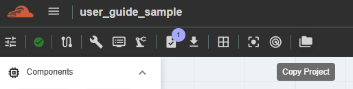
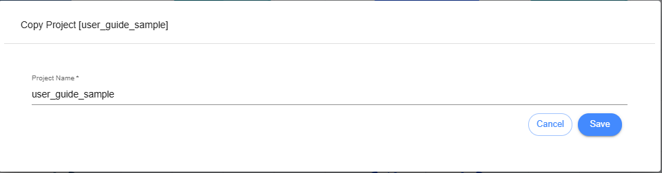

Copy Project
======================================================
This feature allows you to create a new project by copying an existing one. This function saves time by avoiding the need to redo the entire project just to modify a part of it.

The Copy Project function can also be used to copy a project from another owner. After copying, the ownership of the copied project will be updated.

Limitations:
  -	Upper case only on the first letters. 
  -	Use only alphanumeric keys including ñ and Ñ, spaces and no special characters. 
