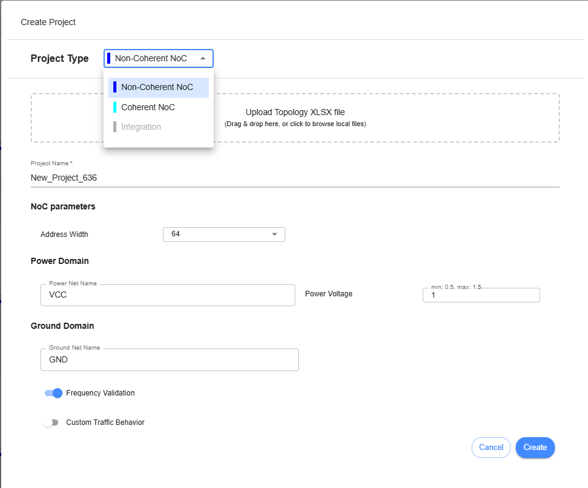

Non-Coherent NoC Topology 
====================================================
  1. Create Project

**Project Type** – A dropdown button that allows the user to select the type of project to design. The user can choose between Non-Coherent NoC, Coherent NoC, or Integration (which is not yet implemented).

**Drag ‘n drop an XLSX file here, or click to select one** – An area or button to upload an excel file for generating topology. 

**Project Name** – This field is used to name your project. No spaces are allowed; only alphanumeric characters are permitted.

**Address Width** – The user needs to choose either 32 or 64 as the address width for the NoC project.

**Power Net Name** – This field is for naming Power Net.

**Ground Net Name** – This field is for naming Ground Net Name. 

**Power Voltage** – This field is used to set the power voltage for the NoC project. The minimum configuration is 0.5, and the maximum configuration is 1.5.

**Disable frequency validation** – When unchecked, the frequency of each component within the topology must be set individually. When checked, the user does not need to set the frequency for each component.

**Enable Custom Traffic Behavior** – When unchecked, the Traffic Behavior configuration in the project is unavailable. When checked, configuring Traffic Behavior is available inside Initiator and Target device.

After setting up the Project Settings, the user needs to click the ‘Create’ button. A new project tile will be displayed on the Dashboard. The user must click the tile to start designing a topology within the project.

