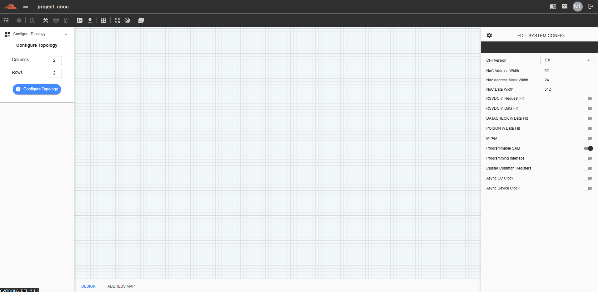

Create Project (C-NoC Topology)
==================================

This feature is for designing a topology in Coherent NoC and can be accessed by selecting 'Coherent NOC' from the Project Type dropdown.

.. image:: images/coherent_noc-create_project_prompt2.png
  :alt: coherent_noc-create_project_prompt
  :align: center

Click the “Create” button to generate a Coherent NoC topology. Once created, the C-NoC project will be added to the dashboard. Click on the project to begin designing.

.. image:: images/cnoc_address_map.png
  :alt: ccnoc_address_map
  :align: center
