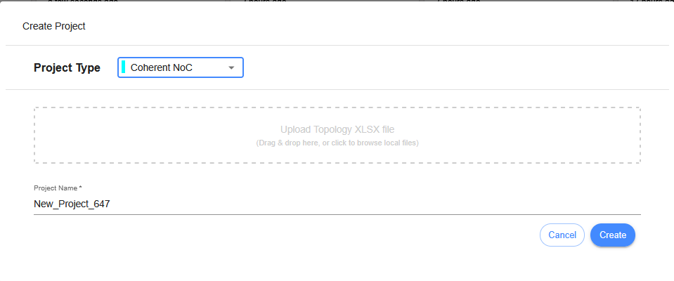
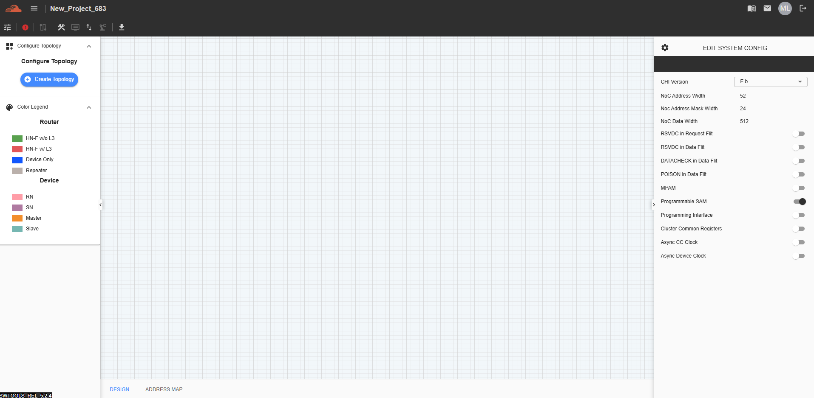
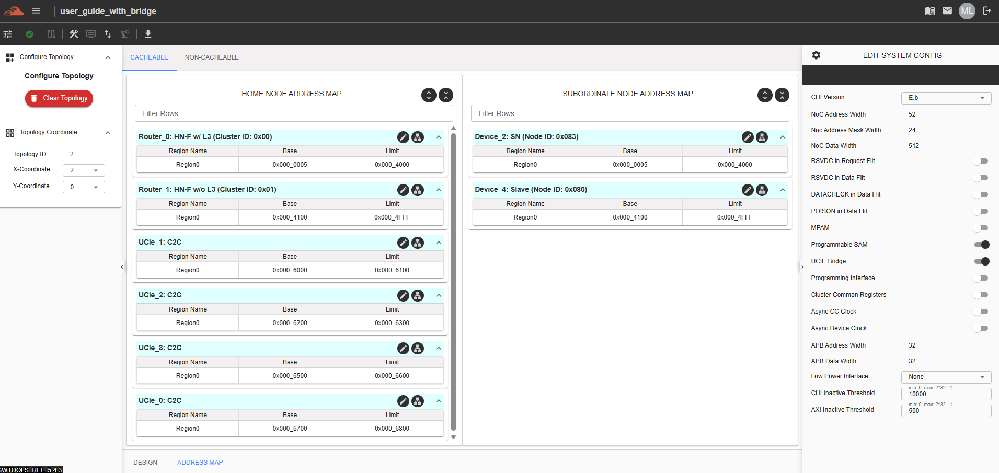

Create Project (C-NoC Topology)
==================================

This feature allows users to design a topology for a Coherent NoC. It can be accessed by selecting "Coherent NoC" from the Project Type dropdown menu.

Click the Create button to generate a Coherent NoC (C-NoC) topology. Once the project is created, it will appear on the Dashboard. Click on the project to open it and begin designing the topology.

