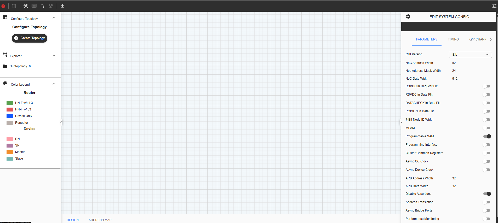

============================================
Creating a Coherent NoC Project
============================================

The **Create Project** workspace allows you to initialize a dedicated design canvas tailored specifically to **Coherent NoC (C-NoC)** topologies. This setup provisions the necessary AMBA CHI/CPI protocol libraries, specialized routing registers, and address mapping matrices required to architect cache-coherent interconnect fabrics.

--------------------------------------------------------------------------------

🔄 The Project Initialization Workflow
=======================================

.. grid:: 1
   :gutter: 3

   .. grid-item-card:: Step 1: Set the Topology Type
      :class-header: bg-light font-weight-bold

      **Project Configuration Prompt**
      
      Launch the new project setup modal from your dashboard. Open the **Project Type** dropdown menu and select **Coherent NoC** from the available architectural options.
      
      .. image:: images/coherent_noc-create_project_prompt2.png
         :alt: Selecting Coherent NoC within the project initialization modal options
         :align: center
         :width: 65%

   .. grid-item-card:: Step 2: Provision the Workspace
      :class-header: bg-light font-weight-bold

      **Database Generation**
      
      Click the primary **Create** button at the bottom of the modal overlay window. 
      
      The design engine will instantly spin up a clean project database container and redirect or list the newly generated design element on your primary workspace dashboard.

--------------------------------------------------------------------------------

🚀 Launching Your Interactive Canvas
====================================

Once initialization completes, your new architecture workspace maps directly onto the primary tracking panel grid as an independent repository tile.

.. tip::
   To open your fresh canvas, simply single-click or double-click anywhere on the newly generated project card. This will load the interactive grid environment where you can establish rows, columns, and drop in cache-coherent routing components.
