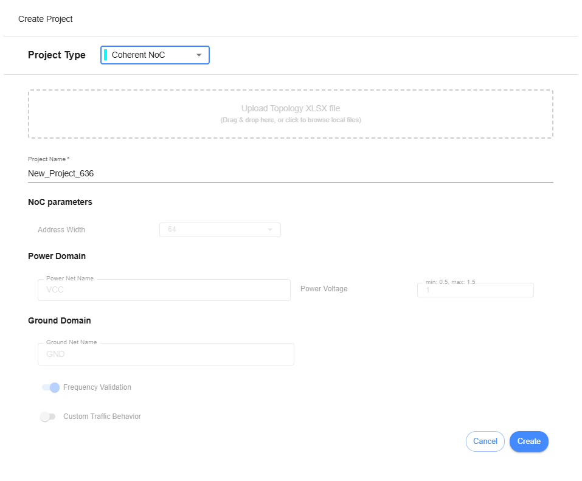
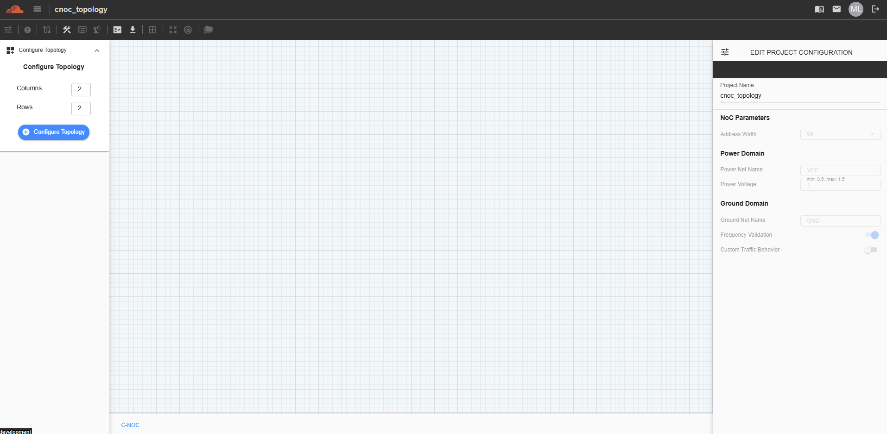

Coherent NoC Topology
==================================
  1. Create Project
This feature is for designing a topology in Coherent NoC and can be accessed by selecting 'Coherent NOC' from the Project Type dropdown.

Click the “Create” button to generate a Coherent NoC topology. Once created, the C-NoC project will be added to the dashboard. Click on the project to begin designing.

