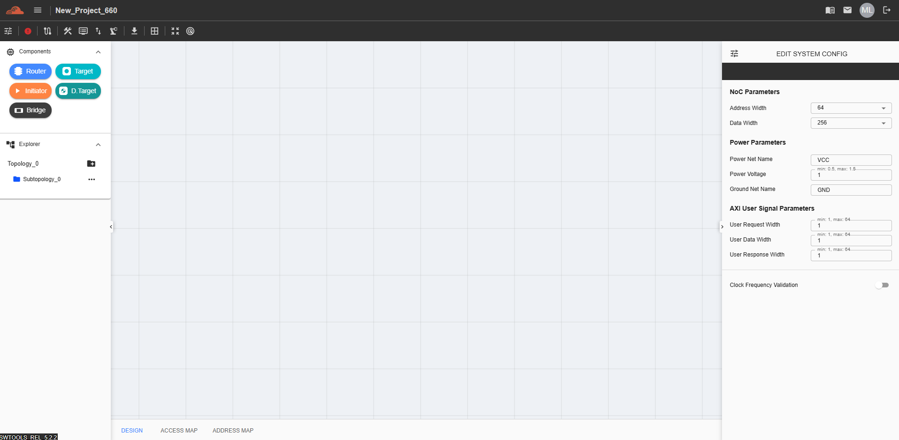

Create Project (NC-NoC Topology)
====================================================

.. image:: images/nc_noc-create_project_prompt3.png
  :alt: nc_noc-create_project_prompt
  :align: center

The Project Settings panel allows users to configure the initial parameters before creating a topology project.

Fields and Options

**Project Type**
- A dropdown menu that allows the user to select the type of project to design. The available options are:

  - Non-Coherent NoC

  - Coherent NoC

  - Integration (currently not implemented)

**Upload Topology XLSX File**
- A field or button that enables the user to upload an Excel file (.xlsx) to auto-generate a topology.

**Project Name**
  - A required input field to assign a name to the project.

  - Spaces are not allowed

  - Only alphanumeric characters are permitted

**Creating the Project**
- After configuring the project settings, click the Create button. A new project tile will appear on the Dashboard. Click this tile to begin designing the topology within the selected project.

