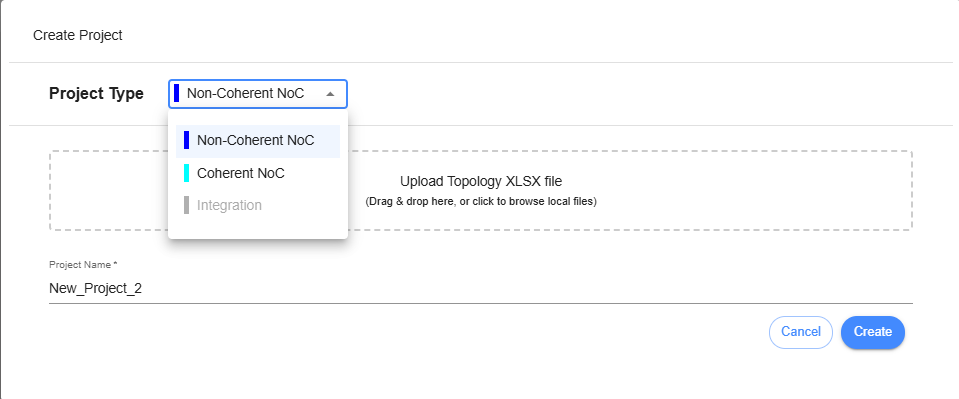
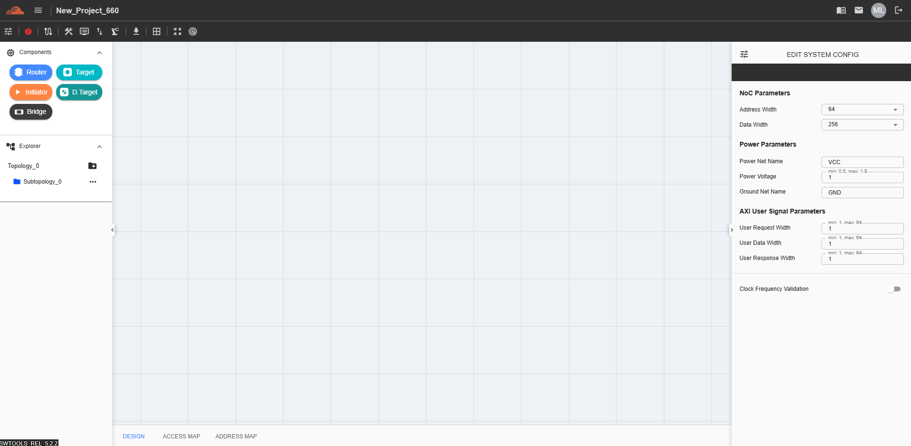

====================================================
Creating a Non-Coherent NoC Project
====================================================

The **Create Project** configuration workflow initializes a clean design canvas explicitly optimized for **Non-Coherent NoC (NC-NoC)** topologies. This setup loads standard memory-mapped packet structures and routing interfaces (such as standard AXI or AHB) for architectures that do not require hardware-managed cache coherence.

--------------------------------------------------------------------------------

Project Settings Configuration Options
=========================================

The Project Settings wizard panel allows you to configure essential design rules and data sources before generating your hardware canvas layout.

.. list-table:: Project Configuration Form Matrix
   :widths: 25 25 50
   :header-rows: 1

   * - Field Parameter
     - Setting Input Type
     - Description & Platform Entry Constraints
   * - **Project Type**
     - Dropdown Selector
     - Selects the target fabric architecture. Options include:
       
       * **Non-Coherent NoC** — Activates memory-mapped routing.
       * **Coherent NoC** — Toggles cache-coherent (CHI) structures.
       * *Integration* — *(Currently not implemented).*
   * - **Project Name**
     - String Input Block
     - **Required Field.** Enter a unique layout identifier name. 
       
       *(Subject to strict naming constraints below).*
   * - **Upload Topology XLSX / JSON**
     - File Upload Actions
     - Optional configuration paths. Allows you to skip manual mesh generation by seeding your fabric directly from pre-defined hardware spreadsheets.

.. seealso::
   For detailed formatting templates and strict file rules regarding automated netlist importing, visit the complete :doc:`Uploading a Topology <uploadtopology>` user guide page.

--------------------------------------------------------------------------------

String Validation & Naming Constraints
=========================================

The database registration engine enforces strict validation rules on the project name field. Input strings failing these constraints will trigger submission blocks:

.. warning::
   **Project Naming Constraints:**
   
   * **Space Prohibition:** Whitespace characters are strictly forbidden anywhere inside the project name string field (e.g., use ``My_NC_NoC`` or ``MyNCNoC`` instead of ``My NC NoC``).
   * **Allowed Characters:** The input processor handles standard **alphanumeric characters only**. Special symbols, punctuation marks, and mathematical operators are completely prohibited.

--------------------------------------------------------------------------------

Launching Your Interconnect Workspace
========================================

Once you have verified all configuration parameters and file upload pointers, click the **Create** action button at the bottom of the form panel. 

The tool will compile your project database and place a fresh, independent design tile container on your primary tracking dashboard. Simply click the new repository tile to expand the workspace and begin routing your mesh architecture.
