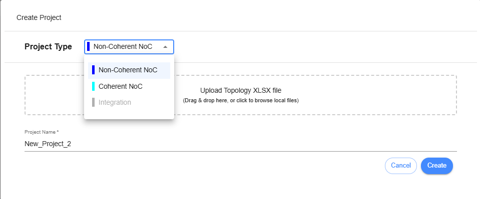

Create Project (NC-NoC Topology)
====================================================

**Project Type** – A dropdown button that allows the user to select the type of project to design. The user can choose between Non-Coherent NoC, Coherent NoC, or Integration (which is not yet implemented).

**Upload Topology XLSX file** – An area or button to upload an excel file for generating topology. 

**Project Name** – This field is used to name your project. No spaces are allowed; only alphanumeric characters are permitted.

After setting up the Project Settings, the user needs to click the ‘Create’ button. A new project tile will be displayed on the Dashboard. The user must click the tile to start designing a topology within the project.

.. image:: images/non_coherent_noc_project-grid_view.png
  :alt: non_coherent_noc_project-grid_view
  :align: center

