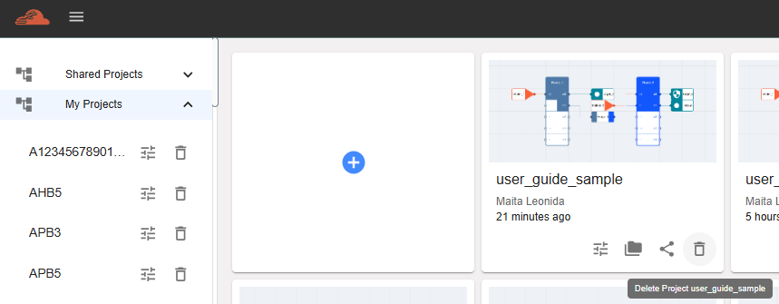

Delete Project
==================================================

To delete a project, user must go to Dashboard and select a project to delete. Click ‘Delete Project’ icon to start deletion. 

Upon clicking ‘Delete Project’ button, a confirmation window will be displayed. Click ‘Delete’ to proceed with the project deletion. 

.. image:: images/delete_project-confirmation_window.png
  :alt: delete_project-confirmation_window
  :align: center

Notes:
  -	Before deleting a project, ensure that any important data are backed up or shared. This is crucial if the project contains valuable information that might be needed later. 
  -	Ensure that you are selecting the correct project, as deletion is irreversible. 
  -	Communicate with your team before deletion, especially if they rely on the project. 
